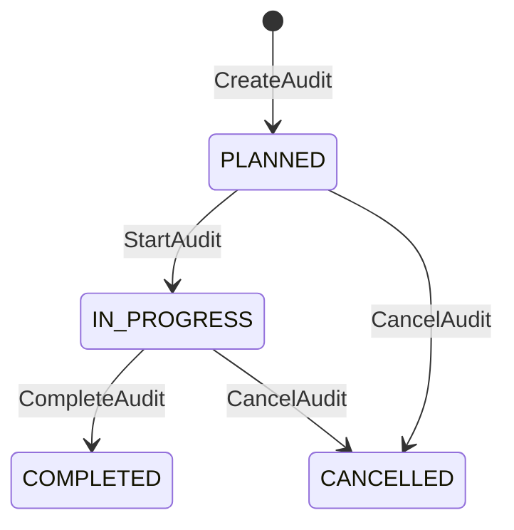

# AUDIT_SYSTEM.md — Subsistema de Auditorías del QMS

## 1. Audit Conflicts

### CONFLICT-001: Estado `CLOSED` en `Audit`

| Campo | Valor |
|---|---|
| **Fuente 1** | `WORKFLOW_SPEC.md` §14.1 — incluye `CLOSED` como estado de `Audit` |
| **Fuente 2** | `prisma/schema.prisma` — enum `AuditStatus` **no incluye** `CLOSED` |
| **Fuente 3** | `DATABASE.md` §23.1 — estados `PLANNED`, `IN_PROGRESS`, `COMPLETED`, `CANCELLED` |
| **Conflicto** | `WORKFLOW_SPEC.md` define `CLOSED` como estado final de auditoría, pero ni el schema ni la especificación de BD lo soportan actualmente. |
| **Impacto** | No se puede persistir `CLOSED` sin modificar el schema. El dominio conceptual espera un cierre formal diferenciado de `COMPLETED`. |
| **Resolución recomendada** | Tratar `COMPLETED` como estado final operativo. El cierre formal se modela como un flag `isClosed` o una transición a `COMPLETED` con evento `AuditClosed`. En una migración futura se puede agregar `CLOSED` al enum. `AUDIT_SYSTEM.md` opera sobre `COMPLETED` como estado final hasta que el schema se actualice. |

### CONFLICT-002: Estado `SCHEDULED` en `Audit`

| Campo | Valor |
|---|---|
| **Fuente 1** | `WORKFLOW_SPEC.md` §14.2 — menciona `SCHEDULED` como estado |
| **Fuente 2** | `prisma/schema.prisma` — enum `AuditStatus` **no incluye** `SCHEDULED` |
| **Fuente 3** | `DATABASE.md` — estados `PLANNED`, `IN_PROGRESS`, `COMPLETED`, `CANCELLED` |
| **Conflicto** | `SCHEDULED` existe en el workflow conceptual pero no en el modelo de persistencia. |
| **Impacto** | No se puede distinguir entre planificada y programada en base de datos. |
| **Resolución recomendada** | Usar `PLANNED` para ambas fases. La planificación detallada se modela mediante campos de fechas (`plannedStart`, `plannedEnd`) y asignaciones de equipo, no mediante un estado adicional. |

---

## 2. Principles

### 2.1 Principios del Subsistema de Auditorías

El sistema de auditorías debe garantizar:

- **Independencia**: el equipo auditor no debe depender funcionalmente del área auditada.
- **Objetividad**: los hallazgos se basan en evidencia, no en opiniones.
- **Trazabilidad**: toda operación crítica genera registro inmutable.
- **Evidencia**: los hallazgos deben estar soportados por fuentes verificables.
- **Criterios claros**: la auditoría se evalúa contra requisitos explícitos.
- **Alcance definido**: la auditoría tiene límites explícitos de procesos, departamentos y periodo.
- **Responsables**: cada auditoría tiene un líder y un equipo asignado.
- **Fechas**: planificadas y reales deben registrarse.
- **Hallazgos reproducibles**: cualquier hallazgo debe poder ser verificado por un tercero.
- **Seguimiento**: las no conformidades derivadas tienen tratamiento y verificación.
- **Cierre verificable**: la auditoría solo se cierra cuando se cumplen condiciones explícitas.

### 2.2 Integración con AUTH_SPEC.md

Toda operación de auditoría requiere:
1. **Authentication**: JWT válido.
2. **Tenant Context**: `organizationId` de la auditoría coincide con el del JWT.
3. **Permission**: permiso explícito por operación (`audits:start`, `audits:complete`, etc.).
4. **Resource Authorization**: el recurso pertenece al tenant y el usuario tiene asignación o rol autorizado.

### 2.3 Integración con WORKFLOW_SPEC.md

**Workflow Engine está DEFERRED.** No es dependencia obligatoria para Audit System.

Los flujos de auditoría se implementan mediante explicit domain transition rules en `AuditsService`, siguiendo el patrón establecido por Documents:

```
Controller
    ↓
Application Service (AuditsService)
    ↓
Domain Transition Rules (validación de estado + precondiciones)
    ↓
Repository
    ↓
Prisma
```

Esto garantiza:
- Transiciones válidas documentadas y validadas.
- Autorización por permiso explícito.
- Tenant isolation.
- Audit log automático.
- Eventos de dominio cuando corresponda.

No se requiere Workflow Engine genérico para esta fase.

### 2.4 Integración con DOCUMENT_MANAGEMENT.md

Las auditorías pueden utilizar documentos controlados como evidencia. La relación no afecta el ciclo de vida del documento.

---

## 3. Audit Program

### 3.1 Definición

`AuditProgram` agrupa auditorías por periodo y objetivo estratégico.

Propósito: planificar el ciclo de auditorías internas de la organización.

### 3.2 Campos

| Campo | Tipo | Descripción |
|---|---|---|
| `id` | UUID | Identificador único. |
| `organizationId` | UUID | Tenant. |
| `name` | string | Nombre del programa. |
| `description` | text | Objetivo y alcance general. |
| `periodStart` | date | Inicio del periodo. |
| `periodEnd` | date | Fin del periodo. |
| `responsibleId` | UUID | Responsable del programa. |
| `status` | string | Estado actual. |
| `createdAt` | timestamp | Fecha de creación. |
| `updatedAt` | timestamp | Última actualización. |

### 3.3 Estados

**Audit Program:**

| Estado | Descripción |
|---|---|
| `PLANNED` | Programa planificado. |
| `ACTIVE` | Programa activo (auditorías en ejecución). |
| `COMPLETED` | Programa finalizado. |
| `CANCELLED` | Programa cancelado. |

**Audit:**

| Estado | Descripción |
|---|---|
| `PLANNED` | Auditoría planificada, pendiente de inicio. |
| `IN_PROGRESS` | Auditoría en ejecución. |
| `COMPLETED` | Auditoría finalizada/cerrada funcionalmente. |
| `CANCELLED` | Auditoría cancelada. |

> **Nota:** El schema de Prisma define `AuditStatus` enum con valores `PLANNED`, `IN_PROGRESS`, `COMPLETED`, `CANCELLED`. Sin embargo, los modelos `AuditProgram` y `Audit` usan `String` para `status` (default `PLANNED`), no el enum. Los estados `DRAFT`, `ACTIVE` y `CLOSED` definidos en versiones anteriores de esta documentación NO existen como valores persistidos. `COMPLETED` representa el cierre funcional de la auditoría.

---

## 4. Audit Program Lifecycle

### 4.1 Estados Válidos

| Estado | Descripción |
|---|---|
| `PLANNED` | Programa planificado (estado inicial). |
| `COMPLETED` | Programa finalizado. |
| `CANCELLED` | Programa cancelado. |

> **Nota:** `DRAFT`, `ACTIVE` y `CLOSED` NO existen como estados persistidos en `schema.prisma`. El modelo `AuditProgram` usa `String` para `status` (default `PLANNED`).

### 4.2 Transiciones Válidas

```
PLANNED → COMPLETED
PLANNED → CANCELLED
COMPLETED → CANCELLED (si aplica)
```

### 4.3 Implementación

Las transiciones se implementan mediante explicit domain transition rules en `AuditProgramsService`, siguiendo el patrón de Documents:

```
Controller
    ↓
Application Service (AuditProgramsService)
    ↓
Domain Transition Rules (validación de estado + precondiciones)
    ↓
Repository
    ↓
Prisma
```

No se requiere Workflow Engine.

---

## 5. Risk-Based Audit Planning

### 5.1 Criterios de Priorización

El programa de auditorías puede priorizar auditorías basándose en:

| Criterio | Peso sugerido | Descripción |
|---|---|---|
| `riskLevel` | Alto | Riesgos identificados con score elevado. |
| `previousFindings` | Medio | Historial de hallazgos en el proceso. |
| `previousNonconformities` | Alto | No conformidades abiertas o recurrentes. |
| `processCriticality` | Alto | Procesos críticos para el negocio o cumplimiento. |
| `complianceImportance` | Alto | Requisitos normativos con impacto regulatorio. |
| `previousAuditResults` | Medio | Resultados de auditorías anteriores. |

### 5.2 Frecuencias

| Frecuencia | Aplicación |
|---|---|
| `annual` | Auditorías anuales obligatorias. |
| `semiannual` | Auditorías semestrales. |
| `quarterly` | Auditorías trimestrales. |
| `event-based` | Disparadas por eventos (no conformidad, cambio normativo, incidente). |
| `risk-based` | Priorizadas según criterios de riesgo. |

### 5.3 Regla

No asumir que todas las auditorías tienen la misma frecuencia. La frecuencia se define por proceso, riesgo o requisito normativo.

---

## 6. Audit Creation

### 6.1 Identidad

| Campo | Tipo | Descripción | Obligatorio |
|---|---|---|---|
| `id` | UUID | Identificador único. | Sí |
| `organizationId` | UUID | Tenant. | Sí |
| `auditProgramId` | UUID | Programa al que pertenece (opcional). | No |
| `code` | string | Código único en el tenant. | Sí |
| `title` | string | Título de la auditoría. | Sí |
| `auditType` | string | Tipo de auditoría. | Sí |
| `objective` | text | Objetivo explícito. | Sí |
| `scope` | text | Alcance definido. | Sí |
| `criteria` | text | Criterios de evaluación. | Sí |
| `plannedStart` | timestamp | Inicio planificado. | Sí |
| `plannedEnd` | timestamp | Fin planificado. | Sí |
| `actualStart` | timestamp | Inicio real. | No |
| `actualEnd` | timestamp | Fin real. | No |
| `leadAuditorId` | UUID | Auditor líder. | Sí |
| `status` | string | Estado actual. | Sí |
| `createdAt` | timestamp | Fecha de creación. | Sí |
| `updatedAt` | timestamp | Última actualización. | Sí |

### 6.2 Campos Adicionales

- `processId`: proceso auditado.
- `departmentId`: departamento auditado.
- `areaId`: área auditada.

---

## 7. Audit Types

### 7.1 Categorías Soportadas

| Tipo | Descripción |
|---|---|
| `INTERNAL` | Auditoría interna del SGC. |
| `EXTERNAL` | Auditoría externa (cliente, entidad). |
| `SUPPLIER` | Auditoría a proveedor. |
| `REGULATORY` | Auditoría regulatoria. |
| `CERTIFICATION` | Auditoría de certificación. |
| `FOLLOW_UP` | Seguimiento de hallazgos anteriores. |

> **Nota:** Usar únicamente categorías compatibles con `DATABASE.md` y el esquema de dominio. Estas categorías se almacenan como strings en `Audit.auditType`.

---

## 8. Audit Objective

### 8.1 Definición

Toda auditoría debe tener un objetivo explícito.

### 8.2 Ejemplos

- Verificar cumplimiento de ISO 9001:2015 en proceso de producción.
- Evaluar efectividad de acciones correctivas de no conformidad NC-2024-001.
- Verificar conformidad de procedimiento PR-2024-003.
- Evaluar desempeño del proceso de gestión documental.
- Seguimiento de hallazgos de auditoría anterior.

### 8.3 Regla

El objetivo no puede ser genérico. Debe ser medible o verificable.

---

## 9. Audit Scope

### 9.1 Componentes

| Componente | Descripción |
|---|---|
| `processes` | Procesos incluidos en la auditoría. |
| `departments` | Departamentos incluidos. |
| `locations` | Ubicaciones físicas o sistemas. |
| `requirements` | Requisitos normativos aplicables. |
| `documents` | Documentos controlados relevantes. |
| `activities` | Actividades específicas a evaluar. |
| `period` | Periodo temporal auditado. |

### 9.2 Regla

El alcance debe ser explícito y delimitado. No se permite scope ambiguo.

---

## 10. Audit Criteria

### 10.1 Definición

Criterios contra los cuales se evalúa la conformidad.

### 10.2 Tipos

| Tipo | Ejemplo |
|---|---|
| `ISO requirements` | ISO 9001:2015 cláusula 7.1.5. |
| `internal procedures` | Procedimiento PR-001. |
| `regulations` | Regulación local aplicable. |
| `policies` | Política de Calidad. |
| `contractual requirements` | Requisitos contractuales con cliente. |

### 10.3 Regla

Los criterios deben ser verificables y estar disponibles para el equipo auditor.

---

## 11. Requirement Traceability

### 11.1 Cadena de Trazabilidad

```
Standard
  ↓
Requirement
  ↓
Audit
  ↓
Checklist Item
  ↓
Evidence
  ↓
Finding
  ↓
Corrective Action
```

### 11.2 Propósito

Permitir demostrar cómo un requisito normativo fue verificado, qué evidencia lo soporta, qué hallazgos se generaron y qué acciones correctivas se derivaron.

### 11.3 Regla

Cada `AuditChecklistItem` puede vincularse a un `StandardRequirement`. Cada `AuditFinding` puede vincularse a uno o varios `AuditChecklistItem`. Cada `Nonconformity` deriva de un `AuditFinding`.

---

## 12. Audit Team

### 12.1 Roles

| Rol | Responsabilidad | Permiso |
|---|---|---|
| `Lead Auditor` | Lidera la auditoría, emite el informe. | `audits:lead` |
| `Auditor` | Ejecuta checklist, recopila evidencia, genera findings. | `audits:execute` |
| `Observer` | Acompaña como testigo, no emite findings. | Ninguno (solo lectura) |
| `Technical Expert` | Provee conocimiento técnico específico. | `audits:advise` |

### 12.2 Asignación

- Un auditor puede pertenecer a múltiples auditorías.
- Un auditor no puede ser `Lead Auditor` y `Auditor` de la misma auditoría (si aplica segregación).
- Las asignaciones deben ser trazables.

---

## 13. Auditor Independence

### 13.1 Reglas de Independencia

- Un auditor no debe auditar directamente su propio trabajo cuando la independencia sea requerida.
- El `Lead Auditor` debe ser independiente del área auditada.
- Si existe conflicto de interés, el auditor debe recusarse.

### 13.2 Conflicto de Interés

Se considera conflicto cuando:
- El auditor es responsable del proceso auditado.
- El auditor reporta funcionalmente al responsable del proceso.
- El auditor tiene interés personal en el resultado.

### 13.3 Recusación

- El auditor declara conflicto antes de iniciar.
- Se asigna un reemplazo.
- Se registra en `audit_logs`.

### 13.4 Reemplazo

- El reemplazo debe tener competencia equivalente.
- No se permite auto-reemplazo.
- La recusación no anula hallazgos previos.

---

## 14. Auditor Assignment

### 14.1 Campos

| Campo | Tipo | Descripción |
|---|---|---|
| `auditId` | UUID | Auditoría asignada. |
| `userId` | UUID | Auditor asignado. |
| `role` | string | `LEAD_AUDITOR`, `AUDITOR`, `OBSERVER`, `TECHNICAL_EXPERT`. |
| `assignedAt` | timestamp | Fecha de asignación. |
| `startDate` | timestamp | Inicio de participación. |
| `endDate` | timestamp | Fin de participación. |

### 14.2 Reglas

- Toda asignación debe quedar trazable.
- No se permite asignar un auditor que tenga conflicto de interés.
- La asignación puede tener fecha de inicio y fin.

---

[PAUSA DE SEGURIDAD - FASE 1 COMPLETADA. Solicita la FASE 2 para continuar con Ejecución, Checklists, Evidencias y Hallazgos]

---

## 15. Audit Planning

### 15.1 Definición

Antes de iniciar una auditoría deben estar definidos:

- **objective**: objetivo explícito y medible.
- **scope**: alcance delimitado de procesos, departamentos y periodo.
- **criteria**: normas, procedimientos o requisitos aplicables.
- **team**: auditores asignados con roles definidos.
- **dates**: fechas planificadas de inicio y fin.
- **checklist**: lista de verificación disponible.
- **required evidence**: evidencia mínima esperada.

### 15.2 Responsable

El `Lead Auditor` es responsable de la planificación detallada.

### 15.3 Aprobación

La planificación debe ser aprobada por el responsable del programa de auditorías o calidad antes de iniciar.

---

## 16. Audit Schedule

### 16.1 Fechas Planificadas vs Reales

| Campo | Tipo | Descripción |
|---|---|---|
| `plannedStart` | timestamp | Inicio planificado. |
| `plannedEnd` | timestamp | Fin planificado. |
| `actualStart` | timestamp | Inicio real. |
| `actualEnd` | timestamp | Fin real. |

### 16.2 Regla

Las fechas planificadas son compromiso; las fechas reales se registran al ejecutar la auditoría. La desviación debe ser documentada.

---

## 17. Audit Workflow

### 17.1 Estados

| Estado | Descripción |
|---|---|
| `PLANNED` | Planificada, pendiente de inicio. |
| `IN_PROGRESS` | Ejecución en curso. |
| `COMPLETED` | Finalizada/cerrada funcionalmente. |
| `CANCELLED` | Cancelada antes o durante ejecución. |

> **Nota:** `SCHEDULED` y `CLOSED` NO existen como estados persistidos en `schema.prisma`. El modelo `Audit` usa `String` para `status` (default `PLANNED`). `COMPLETED` representa el cierre funcional de la auditoría. La planificación detallada se modela mediante campos de fechas (`plannedStart`, `plannedEnd`) y asignaciones de equipo, no mediante un estado adicional.

### 17.2 Transiciones Válidas

```
PLANNED → IN_PROGRESS
PLANNED → CANCELLED
IN_PROGRESS → COMPLETED
IN_PROGRESS → CANCELLED
```

### 17.3 Diagrama de Estados



### 17.4 Implementación

Las transiciones se implementan mediante explicit domain transition rules en `AuditsService`, siguiendo el patrón de Documents:

```
Controller
    ↓
Application Service (AuditsService)
    ↓
Domain Transition Rules (validación de estado + precondiciones)
    ↓
Repository
    ↓
Prisma
```

No se requiere Workflow Engine.

---

## 18. Audit Start

### 18.1 Precondiciones

- Audit exists y pertenece al tenant.
- Status `PLANNED`.
- Lead auditor asignado (`leadAuditorId` existe).
- Audit team asignado (al menos un auditor).
- Scope definido (`scope` no vacío).
- Criteria definidos (`criteria` no vacío).
- Checklist disponible (al menos una `AuditChecklist`).
- Organization activa.

### 18.2 Efectos

- `actualStart` se establece a `NOW()`.
- `status` → `IN_PROGRESS`.
- Se notifica al equipo auditor.
- Se genera evento `AuditStarted`.
- Se genera audit log `AUDIT_STARTED`.

---

## 19. Audit Checklist

### 19.1 Definición

`AuditChecklist` agrupa items de verificación para una auditoría.

### 19.2 Campos

| Campo | Tipo | Descripción |
|---|---|---|
| `id` | UUID | Identificador único. |
| `organizationId` | UUID | Tenant. |
| `auditId` | UUID | Auditoría asociada. |
| `name` | string | Nombre o título de la checklist. |
| `createdAt` | timestamp | Fecha de creación. |

### 19.3 Reglas

- Una auditoría puede tener múltiples checklists.
- La checklist pertenece a la auditoría; no se comparte entre auditorías.
- No se puede modificar una checklist después de iniciada la auditoría (append-only).

---

## 20. Checklist Item

### 20.1 Definición

`AuditChecklistItem` representa una pregunta o criterio de verificación.

### 20.2 Campos

| Campo | Tipo | Descripción |
|---|---|---|
| `id` | UUID | Identificador único. |
| `checklistId` | UUID | Checklist asociada. |
| `requirementId` | UUID | Requisito normativo (opcional). |
| `question` | text | Pregunta o criterio a evaluar. |
| `response` | string | Resultado de la verificación. |
| `evidence` | text | Referencia a evidencia. |
| `comments` | text | Comentarios del auditor. |
| `sortOrder` | integer | Orden de presentación. |
| `createdAt` | timestamp | Fecha de creación. |

### 20.3 Relaciones

- Pertenece a una `AuditChecklist`.
- Puede asociarse a un `StandardRequirement`.
- Puede generar un `AuditFinding`.

---

## 21. Checklist Result

### 21.1 Valores Posibles

| Resultado | Descripción |
|---|---|
| `CONFORMING` | Cumple con el criterio. |
| `NONCONFORMING` | No cumple; genera hallazgo. |
| `NOT_APPLICABLE` | No aplica al alcance. |
| `OBSERVATION` | Cumple pero con mejora potencial. |

### 21.2 Regla

El resultado debe ser explícito. No se permite dejar items sin respuesta al completar la checklist.

---

## 22. Checklist Execution

### 22.1 Registro

Cada ejecución registra:

- **auditor**: usuario que evaluó el item.
- **timestamp**: fecha y hora de la verificación.
- **result**: `CONFORMING`, `NONCONFORMING`, `NOT_APPLICABLE`, `OBSERVATION`.
- **notes**: comentarios textuales.
- **evidence**: referencia a evidencia recopilada.
- **finding**: hallazgo generado (si aplica).

### 22.2 Trazabilidad

Cada respuesta de checklist es trazable a:
- Auditor que la ejecutó.
- Fecha y hora.
- Versión de la checklist en el momento de la ejecución.

---

## 23. Evidence

### 23.1 Definición

`AuditEvidence` representa el soporte documental o registral de un hallazgo o verificación.

### 23.2 Tipos

| Tipo | Descripción |
|---|---|
| `DOCUMENT` | Documento controlado del sistema. |
| `FILE` | Archivo adjunto (imagen, PDF, etc.). |
| `RECORD` | Registro de calidad o sistema. |
| `OBSERVATION` | Observación directa del auditor. |
| `INTERVIEW` | Declaración de personal entrevistado. |
| `SYSTEM_RECORD` | Registro generado por el sistema. |
| `EXTERNAL` | Evidencia externa (certificado, informe). |

### 23.3 Campos

| Campo | Tipo | Descripción |
|---|---|---|
| `id` | UUID | Identificador único. |
| `auditId` | UUID | Auditoría asociada. |
| `checklistItemId` | UUID | Item de checklist (opcional). |
| `evidenceType` | string | Tipo de evidencia. |
| `description` | text | Descripción. |
| `fileAssetId` | UUID | Archivo adjunto (opcional). |
| `createdById` | UUID | Usuario que carga la evidencia. |
| `createdAt` | timestamp | Fecha de carga. |

---

## 24. Evidence Integrity

### 24.1 Algoritmo

SHA-256 del contenido del archivo.

### 24.2 Campos de Integridad

| Campo | Tipo | Descripción |
|---|---|---|
| `sha256Hash` | string | Hash del archivo en el momento de la carga. |
| `source` | string | Origen de la evidencia (upload, system, external). |
| `timestamp` | timestamp | Momento de la carga. |
| `uploaderId` | UUID | Usuario que cargó la evidencia. |
| `version` | string | Versión del archivo si aplica. |

### 24.3 Regla

No permitir que una evidencia histórica cambie silenciosamente. Si el archivo se reemplaza, se debe generar una nueva evidencia con nuevo hash y auditoría.

---

## 25. Evidence vs Document

### 25.1 Diferenciación

| Aspecto | Controlled Document | Audit Evidence |
|---|---|---|
| **Propósito** | Define cómo hacer algo. | Prueba de que algo se hizo o se verificó. |
| **Ciclo de vida** | Versionado, aprobado, publicado. | Inmutable una vez cargada. |
| **Control** | Flujo de revisión y aprobación. | Asociada a una auditoría y checklist. |
| **Relación** | Puede convertirse en evidencia. | No se convierte en documento controlado. |

### 25.2 Regla

Un documento controlado puede utilizarse como evidencia, pero no son conceptualmente la misma entidad.

---

## 26. Audit Notes

### 26.1 Definición

Notas textuales registradas durante la ejecución de la auditoría.

### 26.2 Campos

| Campo | Tipo | Descripción |
|---|---|---|
| `id` | UUID | Identificador único. |
| `auditId` | UUID | Auditoría asociada. |
| `checklistItemId` | UUID | Item de checklist (opcional). |
| `authorId` | UUID | Autor de la nota. |
| `content` | text | Contenido de la nota. |
| `createdAt` | timestamp | Fecha de creación. |

### 26.3 Regla

Las notas no necesariamente representan hallazgos. Son registros de contexto para el equipo auditor.

---

## 27. Findings

### 27.1 Definición

`AuditFinding` representa un hallazgo derivado de una auditoría.

### 27.2 Tipos

| Tipo | Descripción |
|---|---|
| `CONFORMITY` | Cumplimiento positivo. |
| `OBSERVATION` | Cumple pero con oportunidad de mejora. |
| `NON_CONFORMITY` | Incumplimiento que genera no conformidad. |
| `OPPORTUNITY` | Oportunidad de mejora. |

> **Nota:** Respetar `DOMAIN.md` §8.5 y `prisma/schema.prisma` enum `FindingType`.

### 27.3 Campos

| Campo | Tipo | Descripción |
|---|---|---|
| `id` | UUID | Identificador único. |
| `organizationId` | UUID | Tenant. |
| `auditId` | UUID | Auditoría asociada. |
| `checklistItemId` | UUID | Item de checklist (opcional). |
| `requirementId` | UUID | Requisito normativo (opcional). |
| `findingType` | string | Tipo de hallazgo. |
| `title` | string | Título corto. |
| `description` | text | Descripción detallada. |
| `evidence` | text | Evidencia soporte. |
| `severity` | string | Severidad (si aplica). |
| `identifiedById` | UUID | Auditor que identifica. |
| `identifiedAt` | timestamp | Fecha de identificación. |
| `status` | string | Estado del hallazgo. |
| `createdAt` | timestamp | Fecha de creación. |

---

## 28. Finding Structure

### 28.1 Componentes

Un finding debe poder contener:

- **statement**: declaración del hallazgo.
- **evidence**: evidencia que lo soporta.
- **criteria**: criterio incumplido o verificado.
- **condition**: condición observada.
- **impact**: impacto en el sistema de gestión.
- **classification**: tipo (`CONFORMITY`, `NON_CONFORMITY`, etc.).
- **severity**: `MINOR`, `MAJOR`, `CRITICAL` (si aplica).
- **auditor**: usuario que lo identificó.
- **date**: fecha de identificación.

### 28.2 Regla

Todo hallazgo de tipo `NON_CONFORMITY` debe tener al menos una evidencia y un criterio asociado.

---

## 29. Finding Traceability

### 29.1 Preguntas Obligatorias

Toda no conformidad debe poder responder:

- ¿Qué requisito incumple?
- ¿Qué evidencia lo demuestra?
- ¿Dónde ocurrió?
- ¿Cuándo ocurrió?
- ¿Quién lo identificó?
- ¿Cuál es el impacto?

### 29.2 Mecanismo

La trazabilidad se materializa mediante relaciones:

```
AuditFinding
  ↓ (checklistItemId)
AuditChecklistItem
  ↓ (requirementId)
StandardRequirement
  ↓ (evidence)
AuditEvidence / FileAsset
```

---

## 30. Nonconformity Creation

### 30.1 Cuándo se Genera

Un `AuditFinding` de tipo `NON_CONFORMITY` dispara automáticamente la creación de una `Nonconformity` vinculada.

### 30.2 Campos Copiados

- `title` y `description` del finding.
- `severity` del finding.
- `identifiedById` como responsable inicial.
- `auditId` y `findingId` como trazabilidad.

### 30.3 Regla

No toda observación genera automáticamente una no conformidad. Solo `NON_CONFORMITY` lo hace de forma automática. `OBSERVATION` y `OPPORTUNITY` requieren decisión explícita.

---

## 31. Nonconformity Link

### 31.1 Relación

```
AuditFinding (1) ──> (N) Nonconformity
```

### 31.2 Regla

La no conformidad debe conservar el contexto original del hallazgo:

- `auditId` de origen.
- `findingId` de origen.
- `requirementId` afectado.
- `evidence` original.

### 31.3 Trazabilidad

Cualquier consulta a la `Nonconformity` debe poder remitir al `AuditFinding` que la originó.

---

## 32. Severity

### 32.1 Niveles

| Nivel | Descripción |
|---|---|
| `MINOR` | Incumplimiento menor, impacto limitado. |
| `MAJOR` | Incumplimiento significativo, impacto en el sistema. |
| `CRITICAL` | Incumplimiento grave, riesgo alto para personas o negocio. |

### 32.2 Regla

La severidad se determina durante la identificación del hallazgo y puede re-evaluarse durante el tratamiento de la no conformidad.

---

## 33. Finding Validation

### 33.1 Antes de Completar la Auditoría

Todos los findings deben:

- Estar clasificados (`findingType` definido).
- Tener evidencia asociada o documentada.
- Tener criterio definido.
- Tener responsable cuando corresponda.
- Tener seguimiento definido cuando corresponda.

### 33.2 Validación

El `Lead Auditor` valida que todos los findings cumplan estas condiciones antes de completar la auditoría.

---

## 34. Audit Conclusion

### 34.1 Valores

| Conclusión | Descripción |
|---|---|
| `CONFORMING` | Todos los items verificados cumplen. |
| `PARTIALLY_CONFORMING` | Cumplimiento parcial, con hallazgos menores. |
| `NONCONFORMING` | Existen hallazgos mayores o críticos. |

### 34.2 Regla

La conclusión debe derivarse de los resultados de la checklist y los findings, no ser arbitraria.

### 34.3 Registro

Se registra en el informe de auditoría y se incluye en `audit_logs`.

---

[PAUSA DE SEGURIDAD - FASE 2 COMPLETADA. Solicita la FASE 3 para continuar con Reportes, Cierre, Seguimiento y Cobertura]

---

## 35. Audit Report

### 35.1 Definición

Informe formal de resultados de la auditoría.

### 35.2 Contenido

- **objective**: objetivo de la auditoría.
- **scope**: alcance auditado.
- **criteria**: criterios de evaluación.
- **team**: auditores participantes.
- **dates**: fechas planificadas y reales.
- **summary**: resumen ejecutivo.
- **findings**: hallazgos detallados.
- **conclusion**: conclusión de la auditoría.
- **recommendations**: recomendaciones (si aplica).
- **approvals**: aprobaciones del informe.

### 35.3 Estructura

El informe se genera en formato PDF o documento controlado. Se almacena como `FileAsset` vinculado a la auditoría.

---

## 36. Report Immutability

### 36.1 Regla

Una vez aprobado/cerrado el informe, no se modifica.

### 36.2 Cambios Posteriores

Si requiere cambios:
- Se genera nueva versión del informe.
- Se registra la corrección y el motivo.
- Se mantiene el historial de versiones.
- Se actualiza la referencia en `Audit` sin perder la versión anterior.

### 36.3 Trazabilidad

Todo cambio de informe se audita en `audit_logs`.

---

## 37. Audit Approval

### 37.1 Quién Aprueba

- **Lead Auditor**: emite y firma el informe.
- **Quality Manager**: revisa y aprueba formalmente (si el dominio lo requiere).

### 37.2 Reglas

- No se permite autoaprobación cuando contradiga segregation of duties.
- El `Lead Auditor` no puede aprobar su propio informe si existe `Quality Manager`.
- La aprobación registra `approvedAt`, `approvedBy` y comentario opcional.

### 37.3 Flujo

```
Lead Auditor completa informe
  ↓
Quality Manager revisa
  ↓
Aprobación formal
  ↓
Audit cerrada
```

---

## 38. Audit Closure

### 38.1 Condiciones

- Reporte completado y aprobado.
- Findings clasificados.
- Required corrective actions creadas (si aplica).
- Aprobaciones completadas.

### 38.2 Separación de Cierres

| Cierre | Descripción |
|---|---|
| **Audit Closure** | Cierre formal de la auditoría. |
| **Finding Closure** | Cierre de un hallazgo (cuando se resuelve). |
| **Corrective Action Closure** | Cierre de la acción correctiva (cuando se verifica efectividad). |

### 38.3 Regla

La auditoría puede cerrarse con no conformidades abiertas, siempre que tengan seguimiento documentado. No se exige cierre automático de acciones correctivas antes del cierre de auditoría.

---

## 39. Follow-up Audit

### 39.1 Definición

Auditoría de seguimiento para verificar el estado de hallazgos y acciones correctivas de una auditoría anterior.

### 39.2 Relación

```
Original Audit
  ↓
Follow-up Audit
```

### 39.3 Contenido

- Verificar corrective actions ejecutadas.
- Verificar effectiveness.
- Verificar remaining findings.
- Generar nuevos hallazgos si aplica.

### 39.4 Regla

El seguimiento no modifica la auditoría original. Es una auditoría independiente con trazabilidad a la original.

---

## 40. Corrective Action Integration

### 40.1 Flujo

```
AuditFinding (NON_CONFORMITY)
  ↓
Nonconformity
  ↓
RootCauseAnalysis
  ↓
CorrectiveAction
  ↓
Completion
  ↓
Verification
  ↓
Effectiveness
```

### 40.2 Trazabilidad

El sistema mantiene trazabilidad completa:

- `AuditFinding` → `Nonconformity`
- `Nonconformity` → `RootCauseAnalysis`
- `RootCauseAnalysis` → `CorrectiveAction`
- `CorrectiveAction` → `CorrectiveActionVerification`

---

## 41. Effectiveness

### 41.1 Resultados

| Resultado | Descripción |
|---|---|
| `EFFECTIVE` | La acción eliminó la causa raíz. |
| `INEFFECTIVE` | La acción no resolvió el problema. |
| `PARTIALLY_EFFECTIVE` | La acción resolvió parcialmente. |

### 41.2 Regla

Si `INEFFECTIVE`, se debe generar nueva acción correctiva o reabrir la no conformidad.

---

## 42. Audit Evidence Retention

### 42.1 Duración

- Audit program: retención según política organizacional.
- Audit: retención mínima de 7 años o según normativa aplicable.
- Findings: retención vinculada a la auditoría.
- Evidence: retención vinculada a la auditoría.
- Report: retención vinculada a la auditoría.

### 42.2 Regla

La retención debe respetar la política organizacional y los requisitos normativos aplicables.

---

## 43. Audit Access

### 43.1 Permisos por Operación

| Operación | Permission |
|---|---|
| `view` | `audits:read` |
| `create` | `audits:create` |
| `plan` | `audits:plan` |
| `assign` | `audits:assign` |
| `execute` | `audits:execute` |
| `add evidence` | `audits:addEvidence` |
| `create finding` | `findings:create` |
| `complete` | `audits:complete` |
| `approve` | `audits:approve` |
| `close` | `audits:close` |

### 43.2 Resource Authorization

Además del permiso:
- `audit.organizationId === user.organizationId`
- Usuario asignado como auditor o con rol autorizado.
- Estado del recurso permite la operación.

---

## 44. Tenant Isolation

### 44.1 Regla Fundamental

Todas las auditorías pertenecen a una organización.

### 44.2 Prohibiciones

Nunca permitir:
- `Audit` tenant A → `Evidence` tenant B.
- `Finding` tenant A → `Nonconformity` tenant B.
- Acceso a auditorías de otro tenant.

---

## 45. Resource Authorization

### 45.1 Validación

No basta con `audits:read`. También validar:
- `audit.organizationId === user.organizationId`
- Usuario asignado como auditor o con rol autorizado.
- Estado del recurso permite la operación.

---

## 46. Concurrency

### 46.1 Optimistic Locking

Las operaciones de auditoría utilizan optimistic locking.

Mecanismo:
- El cliente envía el valor conocido de `updatedAt` en el header `If-Match`.
- El backend compara con el valor actual; si difiere, retorna `409 ConcurrentUpdate`.

Recursos sujetos:
- Audits
- AuditChecklists
- AuditChecklistItems
- AuditFindings
- AuditEvidences

### 46.2 Ejemplo

Dos auditores modifican el mismo checklist item simultáneamente:
- Solo una transición válida debe ganar.
- La otra recibe `409 ConcurrentUpdate`.

---

## 47. Idempotency

### 47.1 Definición

Una misma operación repetida no debe producir duplicados inesperados.

### 47.2 Mecanismo

Header `Idempotency-Key` en requests críticos.

Backend almacena resultado por clave por 24 horas.

Operaciones que soportan idempotencia:
- Inicio de auditoría.
- Envío de checklist.
- Creación de hallazgos.
- Completado de auditoría.
- Aprobación de informe.
- Cierre de auditoría.

---

## 48. Transaction Boundaries

### 48.1 CompleteAudit

1. Validar estado y permisos.
2. Actualizar `audit.status` → `COMPLETED`.
3. Establecer `actualEnd` → `NOW()`.
4. Validar findings completos.
5. Crear `AuditLog`.
6. Emitir `AuditCompleted` event.

Si una parte falla, rollback completo.

### 48.2 CreateFinding

1. Validar auditoría en progreso.
2. Crear `AuditFinding`.
3. Si `NON_CONFORMITY`, crear `Nonconformity` vinculada.
4. Crear `AuditLog`.
5. Emitir `FindingCreated` event.

---

## 49. Domain Events

| Evento | Aggregate | Trigger | Payload conceptual | Audit |
|---|---|---|---|---|
| `AuditProgramCreated` | AuditProgram | CreateAuditProgram | programId, organizationId, createdBy | sí |
| `AuditProgramActivated` | AuditProgram | ActivateAuditProgram | programId, activatedBy | sí |
| `AuditProgramCompleted` | AuditProgram | CompleteAuditProgram | programId, completedBy | sí |
| `AuditProgramCancelled` | AuditProgram | CancelAuditProgram | programId, cancelledBy, reason | sí |
| `AuditCreated` | Audit | CreateAudit | auditId, programId, code, createdBy | sí |
| `AuditScheduled` | Audit | ScheduleAudit | auditId, plannedStart, plannedEnd | sí |
| `AuditStarted` | Audit | StartAudit | auditId, startedBy, actualStart | sí |
| `AuditChecklistCompleted` | AuditChecklist | CompleteChecklist | checklistId, completedBy | sí |
| `EvidenceAdded` | AuditEvidence | AddEvidence | evidenceId, auditId, checklistItemId | sí |
| `FindingCreated` | AuditFinding | CreateFinding | findingId, auditId, findingType, identifiedBy | sí |
| `NonconformityCreated` | Nonconformity | CreateNonconformity (from finding) | nonconformityId, findingId, createdBy | sí |
| `AuditCompleted` | Audit | CompleteAudit | auditId, completedBy, actualEnd, conclusion | sí |
| `AuditReportApproved` | Audit | ApproveAuditReport | auditId, approvedBy, approvedAt | sí |
| `FindingVerified` | AuditFinding | VerifyFinding | findingId, verifiedBy, result | sí |

---

## 50. Notifications

| Evento | Destinatarios | Tipo |
|---|---|---|
| `AuditAssigned` | Auditores asignados | `AUDIT_ASSIGNED` |
| `AuditStarting` | Auditores, responsables | `AUDIT_STARTING` |
| `FindingCreated` | Lead auditor, responsable de proceso | `FINDING_CREATED` |
| `CorrectiveActionRequired` | Responsable de no conformidad | `CORRECTIVE_ACTION_REQUIRED` |
| `AuditReportPendingApproval` | Quality manager | `AUDIT_REPORT_PENDING` |
| `AuditOverdue` | Lead auditor, calidad | `AUDIT_OVERDUE` |
| `FollowUpDue` | Auditores, responsables | `FOLLOW_UP_DUE` |

---

## 51. Deadlines

### 51.1 Fechas

- `plannedStart` / `plannedEnd`: fechas planificadas.
- `actualStart` / `actualEnd`: fechas reales.
- `nextAuditDate`: próxima auditoría programada.
- `followUpDate`: fecha de seguimiento.

### 51.2 Comportamiento

- **Overdue**: se marca como vencida pero no se cambia el estado automáticamente.
- **Reminders**: jobs envían recordatorios según configuración.
- **Escalations**: si supera umbral, se escala a responsable superior.

### 51.3 Regla

Los jobs automáticos deben mantener trazabilidad. No cambian silenciosamente el estado sin generar eventos.

---

## 52. Audit Metrics

### 52.1 Indicadores Conceptuales

| Métrica | Descripción |
|---|---|
| `auditsPlanned` | Auditorías planificadas en el periodo. |
| `auditsCompleted` | Auditorías completadas. |
| `auditsOverdue` | Auditorías vencidas. |
| `findingsByType` | Hallazgos por tipo. |
| `findingsBySeverity` | Hallazgos por severidad. |
| `findingsByProcess` | Hallazgos por proceso auditado. |
| `nonconformities` | No conformidades generadas. |
| `repeatFindings` | Hallazgos recurrentes. |
| `correctiveActionEffectiveness` | Efectividad de acciones correctivas. |
| `auditCompletionRate` | Porcentaje de auditorías completadas a tiempo. |

### 52.2 Regla

No implementar dashboards todavía. Definir los indicadores para fase futura.

---

## 53. Repeat Findings

### 53.1 Definición

Hallazgo recurrente cuando una condición similar reaparece después de una acción correctiva.

### 53.2 Análisis

- Se marca como repeat finding.
- Se analiza historial de la no conformidad original.
- Se evalúa effectiveness de la acción correctiva anterior.

### 53.3 Regla

Debe permitir análisis histórico para identificar patrones sistémicos.

---

## 54. Audit Risk

### 54.1 Relación

```
Risk
  ↓
Audit Planning
```

### 54.2 Regla

Un riesgo elevado puede aumentar la prioridad de auditoría. La planificación considera el mapa de riesgos de la organización.

---

## 55. Process Coverage

### 55.1 Definición

Análisis de cobertura de procesos auditados.

### 55.2 Estructura

```
Process
  ↓
Audit Coverage
```

### 55.3 Regla

Permitir determinar qué procesos han sido auditados y con qué frecuencia.

---

## 56. Requirement Coverage

### 56.1 Definición

Análisis de cobertura de requisitos normativos.

### 56.2 Estructura

```
Requirement
  ↓
Audits
```

### 56.3 Regla

Permitir identificar requisitos auditados, no auditados, incumplimientos y evidencia asociada.

---

## 57. Audit History

### 57.1 Conservación

Toda auditoría debe conservar:

- creation
- modifications
- assignments
- execution
- findings
- approvals
- closure

### 57.2 Regla

No eliminar historial crítico. Las auditorías son inmutables después del cierre.

---

## 58. Audit Trail

### 58.1 Operaciones Auditables

- create
- schedule
- assign
- start
- add evidence
- create finding
- modify finding
- complete
- approve
- close
- reopen

### 58.2 Registro

Cada operación genera un registro en `audit_logs` con:

- `organizationId`
- `actorId`
- `action`
- `entityType` = `Audit`, `AuditFinding`, `AuditEvidence`
- `entityId`
- `payload` (old_values / new_values)
- `correlationId`
- `createdAt`

---

## 59. Reopening

### 59.1 Definición

Reapertura de una auditoría cerrada.

### 59.2 Reglas

- Actor: `Lead Auditor` o admin con `audits:reopen`.
- Permiso: `audits:reopen`.
- Motivo: obligatorio.
- Condiciones: no viola integridad histórica.
- Audit: se registra `AUDIT_REOPENED`.
- Event: `AuditReopened`.

### 59.3 Limitación

No se permite reabrir si la auditoría fue eliminada por disposición final.

---

## 60. Bulk Operations

### 60.1 Operaciones Masivas Soportadas

- assign auditors
- add participants
- distribute reports

### 60.2 Reglas

- Cada elemento respeta sus propias reglas de autorización.
- No convierte una operación masiva en bypass de seguridad.
- Se registra en audit log con cantidad de elementos afectados.

---

## 61. API Mapping

| Domain Command | State Transition | API Endpoint | Method | Auth | Permission |
|---|---|---|---|---|---|
| `CreateAuditProgram` | `[*] → PLANNED` | *(definir en API_SPEC.md)* | POST | required | `audit_programs:create` |
| `CompleteAuditProgram` | `PLANNED → COMPLETED` | *(definir en API_SPEC.md)* | POST | required | `audit_programs:complete` |
| `CancelAuditProgram` | `PLANNED → CANCELLED` | *(definir en API_SPEC.md)* | POST | required | `audit_programs:cancel` |
| `CreateAudit` | `[*] → PLANNED` | *(definir en API_SPEC.md)* | POST | required | `audits:create` |
| `StartAudit` | `PLANNED → IN_PROGRESS` | *(definir en API_SPEC.md)* | POST | required | `audits:start` |
| `CompleteAudit` | `IN_PROGRESS → COMPLETED` | *(definir en API_SPEC.md)* | POST | required | `audits:complete` |
| `CancelAudit` | `PLANNED/IN_PROGRESS → CANCELLED` | *(definir en API_SPEC.md)* | POST | required | `audits:cancel` |
| `CompleteAudit` | `IN_PROGRESS → COMPLETED` | *(definir en API_SPEC.md)* | POST | required | `audits:complete` |
| `CancelAudit` | `PLANNED/IN_PROGRESS → CANCELLED` | *(definir en API_SPEC.md)* | POST | required | `audits:cancel` |
| `AddEvidence` | `IN_PROGRESS` | *(definir en API_SPEC.md)* | POST | required | `audits:addEvidence` |
| `CreateFinding` | `IN_PROGRESS` | *(definir en API_SPEC.md)* | POST | required | `findings:create` |
| `ApproveAuditReport` | `COMPLETED` | *(definir en API_SPEC.md)* | POST | required | `audits:approve` |

> **Nota:** Los endpoints marcados como *(definir en API_SPEC.md)* deben ser documentados en la especificación de API para completar el mapeo.

---

## 62. Business Rules

### AUD-001
Una auditoría debe tener alcance definido. No se permite iniciar sin `scope`.

### AUD-002
Una auditoría no puede iniciar sin `Lead Auditor` asignado.

### AUD-003
Un hallazgo debe estar soportado por evidencia y criterio cuando corresponda.

### AUD-004
Una no conformidad debe conservar el contexto del hallazgo que la originó.

### AUD-005
Una auditoría cerrada no puede modificarse sin un workflow explícito de reapertura.

### AUD-006
El `Lead Auditor` debe ser independiente del área auditada.

### AUD-007
No se permite autoaprobación del informe de auditoría cuando existe `Quality Manager`.

### AUD-008
Una auditoría no puede cerrarse con findings sin clasificar.

### AUD-009
Las evidencias son inmutables una vez cargadas.

### AUD-010
La evidencia debe almacenarse con hash de integridad.

### AUD-011
Un hallazgo `NON_CONFORMITY` genera automáticamente una `Nonconformity`.

### AUD-012
Una auditoría de seguimiento debe referenciar la auditoría original.

---

## 63. Error Codes

| Código | Descripción |
|---|---|
| `AUDIT_NOT_FOUND` | Auditoría no existe o no pertenece al tenant. |
| `AUDIT_INVALID_STATE` | Estado actual no permite la transición. |
| `AUDIT_NOT_READY` | Faltan precondiciones para iniciar. |
| `AUDITOR_NOT_ASSIGNED` | Lead auditor no asignado. |
| `CHECKLIST_NOT_COMPLETE` | Checklist incompleta. |
| `EVIDENCE_REQUIRED` | Falta evidencia para el finding. |
| `FINDING_INVALID` | Finding sin clasificación o evidencia. |
| `AUDIT_ACCESS_DENIED` | Permiso insuficiente. |
| `AUDIT_CONCURRENT_MODIFICATION` | Conflicto de optimistic locking. |
| `TENANT_MISMATCH` | Recurso no pertenece al tenant. |

---

## 64. Testing

### 64.1 Happy Path

- Crear programa → Crear auditoría → Asignar equipo → Iniciar → Completar checklist → Generar findings → Completar → Aprobar informe → Cerrar.

### 64.2 Invalid Transitions

- Intentar cerrar sin findings clasificados.
- Intentar iniciar sin lead auditor.
- Intentar modificar auditoría cerrada.

### 64.3 Cross-Tenant

- Usuario tenant A intenta acceder auditoría tenant B.
- Usuario tenant A intenta agregar evidencia a auditoría tenant B.

### 64.4 Race Conditions

- Dos auditores editan mismo checklist item simultáneamente.
- Dos auditores crean finding para mismo item.

### 64.5 Edge Cases

- Checklist sin items.
- Finding sin evidencia.
- Auditoría con findings abiertos al cierre.

---

## 65. Traceability Matrix

### 65.1 Estructura

```
Standard
  ↓
Requirement
  ↓
Audit Program
  ↓
Audit
  ↓
Checklist
  ↓
Checklist Item
  ↓
Evidence
  ↓
Finding
  ↓
Nonconformity
  ↓
Corrective Action
  ↓
Verification
```

### 65.2 Propósito

Permitir demostrar trazabilidad completa desde un requisito normativo hasta la verificación de efectividad de la acción correctiva.

---

## 66. Reporting

### 66.1 Información Disponible

- Estado de auditorías (planificadas, en progreso, completadas, cerradas).
- Cumplimiento por proceso.
- Hallazgos por tipo y severidad.
- Acciones correctivas pendientes y vencidas.
- Tendencias históricas.

### 66.2 Regla

No implementar dashboards todavía. Definir la capacidad de generación de reportes para fase futura.

---

## 67. Implementation Boundaries

### 67.1 Capas

| Capa | Responsabilidad | No incluye |
|---|---|---|
| **Controller** | Recibir request, validar DTO, despachar comando. | Reglas de workflow de auditoría. |
| **Application Service** | Orquestar transición, validar precondiciones, ejecutar guards. | Lógica de dominio pura. |
| **Domain** | Reglas de negocio, invariantes, transiciones permitidas. | Detalles de infraestructura. |
| **Repository** | Persistencia de auditorías, checklists, findings. | Lógica de negocio. |
| **Infrastructure** | Prisma, Storage, Malware Scanner, Email. | Reglas de dominio. |

### 67.2 Flujo

```
Controller
  ↓
Application Service
  ↓
Domain (Audit Aggregate)
  ↓
Repository
  ↓
Infrastructure
```

El Controller NO implementa reglas de workflow.

---

## 68. Definition of Done

AUDIT_SYSTEM.md estará terminado cuando:

- [x] Audit Program definido.
- [x] Planning definido.
- [x] Risk-based planning definido.
- [x] Audit definido.
- [x] Audit lifecycle definido.
- [x] Audit team definido.
- [x] Auditor independence definido.
- [x] Scope definido.
- [x] Criteria definido.
- [x] Checklist definido.
- [x] Checklist execution definido.
- [x] Evidence definido.
- [x] Findings definidos.
- [x] Nonconformity integration definida.
- [x] Severity definida.
- [x] Audit report definido.
- [x] Approval definido.
- [x] Closure definido.
- [x] Follow-up definido.
- [x] Corrective action integration definida.
- [x] Effectiveness definida.
- [x] Retention definida.
- [x] Access control definido.
- [x] Tenant isolation definida.
- [x] Concurrency definida.
- [x] Idempotency definida.
- [x] Transaction boundaries definidas.
- [x] Domain events definidos.
- [x] Notifications definidas.
- [x] Metrics definidas.
- [x] Repeat findings definidos.
- [x] Requirement coverage definido.
- [x] Process coverage definido.
- [x] Audit trail definido.
- [x] API mapping definido.
- [x] Business rules enumeradas.
- [x] Error codes definidos.
- [x] Testing definido.
- [x] Traceability matrix definida.
- [x] Reporting definido.
- [x] No contradice DOMAIN.md.
- [x] No contradice WORKFLOW_SPEC.md.
- [x] No contradice DOCUMENT_MANAGEMENT.md.
- [x] No contradice AUTH_SPEC.md.
- [x] No contradice SECURITY.md.
- [x] No contradice DATABASE.md.

---

AUDIT_SYSTEM.md generado. Listo para revisión.