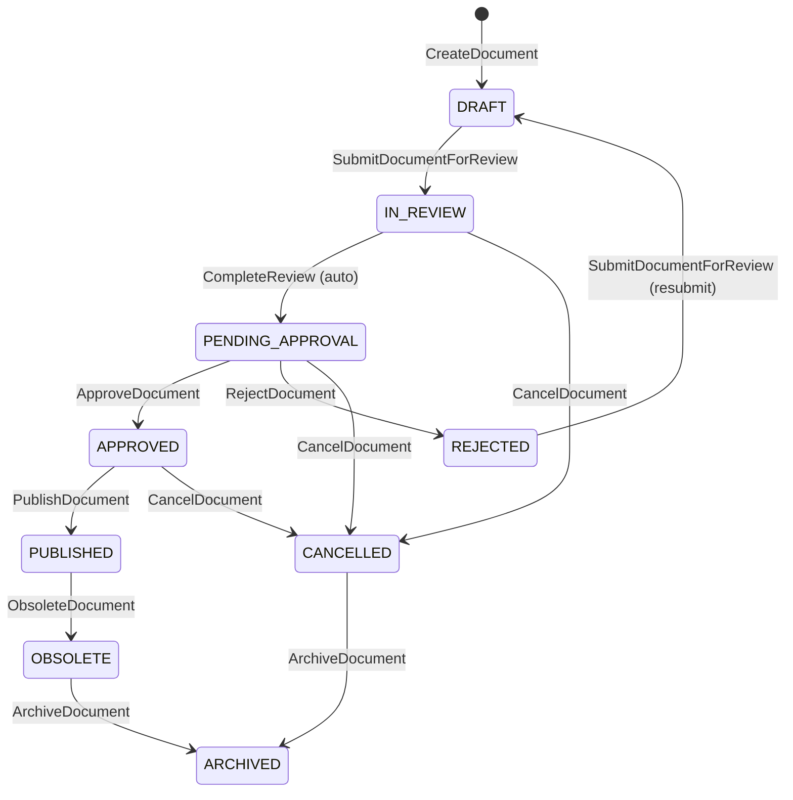
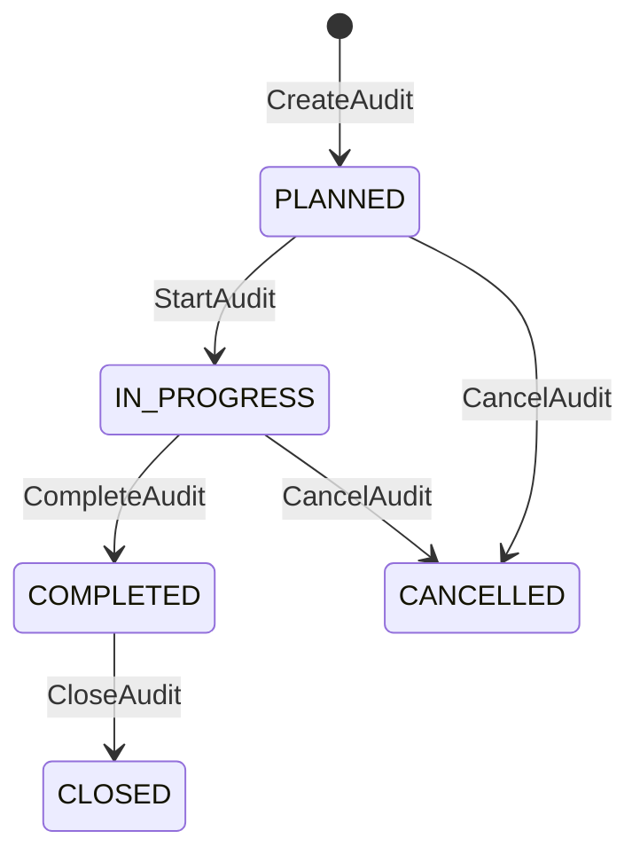
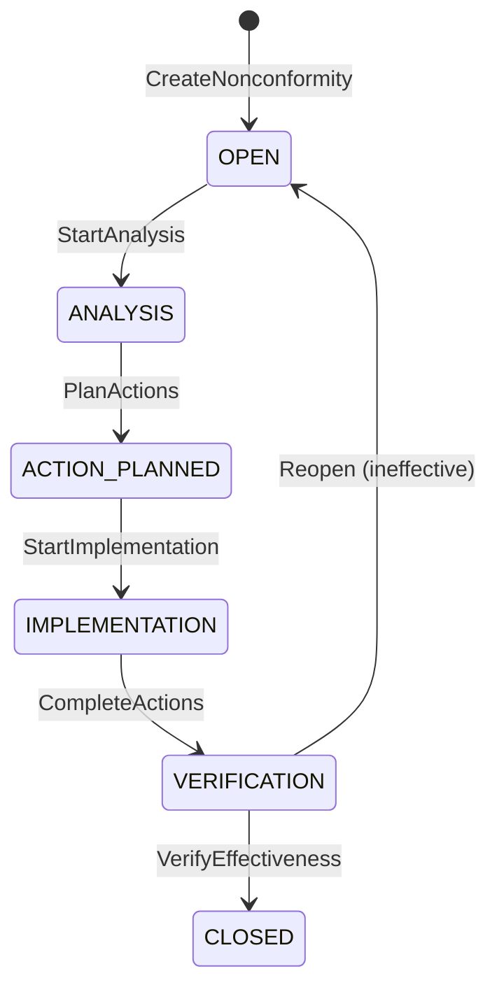
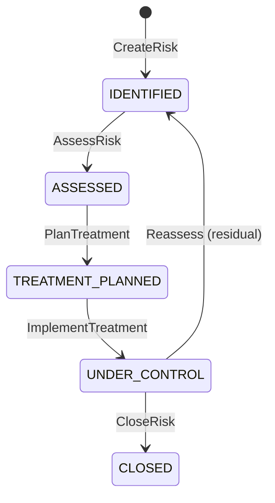
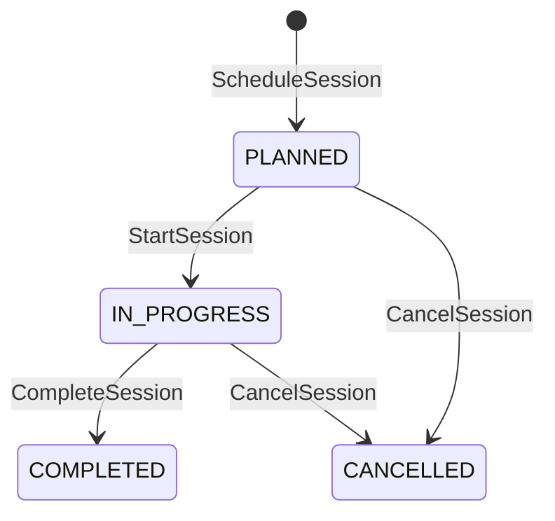

# WORKFLOW_SPEC.md — Workflows & State Machines Specification

**ESTADO: DEFERRED — NO IMPLEMENTADO**

Este documento conserva el diseño conceptual del Workflow Engine. No es funcionalidad implementada.

Los dominios actuales (Documents, Audit System, Nonconformities, Risks, Training, Indicators, Notifications) implementan lifecycle explícito mediante enum-based transition rules en sus respectivos Application Services, sin dependencia de Workflow Engine.

Reevaluar solo si:
- Se implementan 3+ dominios con lifecycle complejo repetido.
- Aparece una necesidad genuina de abstracción genérica.

## 1. Workflow Conflicts

### CONFLICT-001: Estado `CURRENT`

| Campo | Valor |
|---|---|
| **Fuente 1** | `prisma/schema.prisma` — enum `DocumentStatus` incluye `CURRENT` |
| **Fuente 2** | `SECURITY.md` §15.1 — tabla de estados incluye `CURRENT` |
| **Fuente 3** | `DOMAIN.md` §11.1 — lista de estados **no incluye** `CURRENT` |
| **Conflicto** | `CURRENT` existe como estado en capas técnicas pero no en el modelo de dominio. |
| **Impacto** | Puede interpretarse como estado del documento o de la versión vigente, generando transiciones inconsistentes. |
| **Resolución recomendada** | Tratar `CURRENT` como estado derivado, no como estado de máquina explícito. Un documento se considera `CURRENT` cuando su `current_version_id` apunta a una versión `PUBLISHED`. El workflow de estados opera sobre `PUBLISHED`, no sobre `CURRENT`. Se recomienda actualizar `DOMAIN.md` para reflejar que `CURRENT` es un alias de `PUBLISHED` en el contexto de versionado. |

### CONFLICT-002: Transición `IN_REVIEW → PENDING_APPROVAL`

| Campo | Valor |
|---|---|
| **Fuente 1** | `DOMAIN.md` §12.3 — menciona la transición implícitamente en el flujo de aprobación |
| **Fuente 2** | `API_SPEC.md` — no define un endpoint explícito para esta transición |
| **Conflicto** | No existe comando de API documentado para avanzar de `IN_REVIEW` a `PENDING_APPROVAL`. |
| **Impacto** | El flujo queda incompleto en la capa de API; no es posible disparar la transición sin un endpoint. |
| **Resolución recomendada** | Definir la transición como automática cuando todos los revisores asignados completan su evaluación, o agregar un endpoint `POST /documents/:id/complete-review` en `API_SPEC.md`. Esta especificación asume transición automática por completitud de revisiones. |

---

## 2. Principles

### 2.1 Principio Fundamental

Un cambio de estado NO es simplemente modificar una columna.

Toda transición de negocio debe evaluarse como:

```
Actor
  +
Permission
  +
Current State
  +
Preconditions
  +
Business Rules
  +
Transition
  +
Side Effects
  +
Audit
  +
Domain Events
```

### 2.2 Separación de Conceptos

- **State**: condición actual del agregado.
- **Transition**: cambio deliberado de estado.
- **Command**: intención explícita del usuario/sistema.
- **Domain Event**: hecho inmutable que ya ocurrió.
- **Audit**: registro de compliance.
- **Notification**: informativo desacoplado.

### 2.3 Integración con AUTH_SPEC.md

Cada transición requiere:
1. **Authentication**: JWT válido.
2. **Tenant Context**: `organizationId` del JWT coincide.
3. **Permission**: permiso explícito (`documents:approve`, etc.).
4. **Resource Authorization**: propiedad del recurso.

### 2.4 Integración con DOMAIN.md

Los workflows respetan invariantes, bounded contexts y reglas de negocio definidas en `DOMAIN.md`. No se introducen reglas nuevas que contradigan el dominio.

---

## 3. Workflow Engine

### 3.1 Concepto

Motor conceptual común para evaluar transiciones. No es una implementación genérica de BPMN; es un mecanismo estructurado que garantiza invariantes.

### 3.2 Componentes

| Componente | Responsabilidad |
|---|---|
| **State Store** | Persiste el estado actual del agregado. |
| **Transition Registry** | Mapa de transiciones válidas por agregado. |
| **Guard Chain** | Ejecuta preconditions, permissions, tenant checks. |
| **Transition Executor** | Ejecuta la transición atómicamente. |
| **Event Dispatcher** | Emite domain events post-transición. |
| **Audit Recorder** | Registra en `audit_logs`. |
| **Notifier** | Genera notificaciones. |

### 3.3 Flujo de Ejecución

```
Command Received
  ↓
Validate Command (DTO, tenant, auth)
  ↓
Load Aggregate (with optimistic lock)
  ↓
Resolve Transition (current state + action)
  ↓
Evaluate Guards (permissions, preconditions, business rules)
  ↓
Execute Transition (atomic)
  ↓
Persist State Change
  ↓
Dispatch Domain Events
  ↓
Record Audit Log
  ↓
Send Notifications
  ↓
Return Result
```

### 3.4 No-Generic Warning

No se construirá un motor de workflow genérico tipo BPMN a menos que el dominio lo requiera explícitamente. Cada agregado define su máquina de estados de forma explícita y testeable.

---

## 4. Transition Model

Toda transición se documenta mediante la siguiente estructura:

| Campo | Descripción |
|---|---|
| **Current State** | Estado actual del agregado. |
| **Action** | Comando que dispara la transición. |
| **Target State** | Estado resultante. |
| **Actor** | Quién puede ejecutarla (rol o actor específico). |
| **Permission** | Permiso requerido. |
| **Preconditions** | Condiciones que deben cumplirse antes de ejecutar. |
| **Validation** | Validaciones específicas del dominio. |
| **Side Effects** | Efectos secundarios obligatorios. |
| **Domain Events** | Eventos de dominio generados. |
| **Audit Event** | Registro en `audit_logs`. |
| **Notifications** | Notificaciones generadas. |
| **Failure Conditions** | Condiciones de fallo y códigos asociados. |

---

## 5. Document Workflow

### 5.1 Estados

| Estado | Descripción |
|---|---|
| `DRAFT` | Borrador inicial. El documento se edita. |
| `IN_REVIEW` | En revisión por revisores designados. |
| `REJECTED` | Rechazado durante revisión o aprobación. Vuelve a borrador. |
| `PENDING_APPROVAL` | Pendiente de aprobación final. |
| `APPROVED` | Aprobado, listo para publicar. |
| `PUBLISHED` | Publicado y vigente. |
| `OBSOLETE` | Obsoleto, histórico. |
| `CANCELLED` | Cancelado antes de completar el ciclo. |
| `ARCHIVED` | Archivado para conservación. Estado administrativo final. |

### 5.2 Invariantes

- Un documento siempre pertenece a una organización.
- El `code` es único dentro de la organización.
- Solo una versión puede estar vigente como `current_version_id`.
- Una versión publicada no puede modificarse; cualquier cambio requiere nueva versión.
- No se puede publicar sin aprobación.
- La firma registra el hash del contenido en el momento de la firma.

### 5.3 Diagrama de Estados



---

## 6. Document Transitions

### 6.1 DRAFT → IN_REVIEW

| Campo | Valor |
|---|---|
| **Current State** | `DRAFT` |
| **Action** | `SubmitDocumentForReview` |
| **Target State** | `IN_REVIEW` |
| **Actor** | Creador o responsable del documento. |
| **Permission** | `documents:submit` |
| **Preconditions** | - Documento existe y pertenece al tenant.<br>- Estado actual es `DRAFT` o `REJECTED`.<br>- Existe al menos una versión en estado `DRAFT` o `APPROVED`.<br>- Usuario autenticado tiene permiso. |
| **Validation** | - `document.organizationId === user.organizationId`.<br>- Al menos una `DocumentVersion` con `fileAsset` asociado.<br>- Campos obligatorios completos (título, tipo, propietario). |
| **Side Effects** | - Se crea evento de dominio `DocumentSubmittedForReview`.<br>- Se asignan revisores si estaban predefinidos. |
| **Domain Events** | `DocumentSubmittedForReview` |
| **Audit Event** | `DOCUMENT_SUBMITTED` |
| **Notifications** | Se notifica a los revisores asignados. |
| **Failure Conditions** | `INVALID_STATE_TRANSITION` (si estado no es DRAFT/REJECTED), `PRECONDITION_FAILED` (sin versiones), `FORBIDDEN` (sin permiso). |

### 6.2 IN_REVIEW → PENDING_APPROVAL

| Campo | Valor |
|---|---|
| **Current State** | `IN_REVIEW` |
| **Action** | `CompleteReview` (automático) |
| **Target State** | `PENDING_APPROVAL` |
| **Actor** | Sistema (trigger automático). |
| **Permission** | N/A (sistema). |
| **Preconditions** | - Todos los revisores asignados han completado su evaluación.<br>- No hay rechazos pendientes sin resolver. |
| **Validation** | - Contar `DocumentReviewer` con `status != PENDING`.<br>- Si algún reviewer rechazó, transicionar a `REJECTED` en su lugar. |
| **Side Effects** | - Documento queda disponible para aprobación. |
| **Domain Events** | `DocumentReviewCompleted` |
| **Audit Event** | `DOCUMENT_REVIEW_COMPLETED` |
| **Notifications** | Se notifica a aprobadores designados. |
| **Failure Conditions** | `AUDIT_NOT_READY` (revisores pendientes). |

### 6.3 IN_REVIEW → CANCELLED

| Campo | Valor |
|---|---|
| **Current State** | `IN_REVIEW` |
| **Action** | `CancelDocument` |
| **Target State** | `CANCELLED` |
| **Actor** | Creador, responsable o admin con `documents:delete`. |
| **Permission** | `documents:cancel` |
| **Preconditions** | - Documento en `IN_REVIEW`.<br>- Usuario con permiso y mismo tenant. |
| **Validation** | - `document.organizationId === user.organizationId`.<br>- Comentario de cancelación obligatorio. |
| **Side Effects** | - Se marca `isActive = false` (soft delete semántico). |
| **Domain Events** | `DocumentCancelled` |
| **Audit Event** | `DOCUMENT_CANCELLED` |
| **Notifications** | Se notifica a revisores y propietario. |
| **Failure Conditions** | `INVALID_STATE_TRANSITION`, `FORBIDDEN`. |

### 6.4 PENDING_APPROVAL → APPROVED

| Campo | Valor |
|---|---|
| **Current State** | `PENDING_APPROVAL` |
| **Action** | `ApproveDocument` |
| **Target State** | `APPROVED` |
| **Actor** | Aprobador designado. |
| **Permission** | `documents:approve` |
| **Preconditions** | - Documento en `PENDING_APPROVAL`.<br>- Usuario es aprobador designado (ver `DocumentApproval`).<br>- No hay rechazos sin resolver. |
| **Validation** | - `DocumentApproval` existe para este usuario y documento.<br>- `DocumentApproval.status === PENDING`.<br>- Secuencia de aprobación respetada (si aplica). |
| **Side Effects** | - Se crea/actualiza `DocumentApproval` con `status = APPROVED`, `decidedAt`, `comment`.<br>- Si todas las aprobaciones están completas, el documento queda listo para publicar. |
| **Domain Events** | `DocumentApproved` |
| **Audit Event** | `DOCUMENT_APPROVED` |
| **Notifications** | Se notifica al creador y a los interesados. |
| **Failure Conditions** | `INVALID_STATE_TRANSITION`, `FORBIDDEN` (no es aprobador), `ALREADY_APPROVED`. |

### 6.5 PENDING_APPROVAL → REJECTED

| Campo | Valor |
|---|---|
| **Current State** | `PENDING_APPROVAL` |
| **Action** | `RejectDocument` |
| **Target State** | `REJECTED` |
| **Actor** | Aprobador designado. |
| **Permission** | `documents:reject` |
| **Preconditions** | - Documento en `PENDING_APPROVAL`.<br>- Usuario es aprobador designado. |
| **Validation** | - Comentario de rechazo obligatorio.<br>- `DocumentApproval.status === PENDING`. |
| **Side Effects** | - Se crea/actualiza `DocumentApproval` con `status = REJECTED`.<br>- Se resetea el flujo de aprobación. |
| **Domain Events** | `DocumentRejected` |
| **Audit Event** | `DOCUMENT_REJECTED` |
| **Notifications** | Se notifica al creador con motivo de rechazo. |
| **Failure Conditions** | `INVALID_STATE_TRANSITION`, `FORBIDDEN`. |

### 6.6 APPROVED → PUBLISHED

| Campo | Valor |
|---|---|
| **Current State** | `APPROVED` |
| **Action** | `PublishDocument` |
| **Target State** | `PUBLISHED` |
| **Actor** | Responsable de calidad, admin o publicador designado. |
| **Permission** | `documents:publish` |
| **Preconditions** | - Documento en `APPROVED`.<br>- Existe una versión aprobada (`DocumentVersion.status === APPROVED`).<br>- `fileAsset` asociado existe y es accesible.<br>- Todas las aprobaciones requeridas están completas. |
| **Validation** | - `document.currentVersionId` apunta a la versión correcta.<br>- Integridad de `fileHash` de la versión.<br>- Tenant coincide. |
| **Side Effects** | - `document.current_version_id` se actualiza a la versión aprobada.<br>- Se crean distribuciones automáticas según política del tenant.<br>- Se generan acuses de recibo pendientes.<br>- Se registra evento de firma si aplica. |
| **Domain Events** | `DocumentPublished` |
| **Audit Event** | `DOCUMENT_PUBLISHED` |
| **Notifications** | Se notifica a destinatarios de distribución. |
| **Failure Conditions** | `INVALID_STATE_TRANSITION`, `VERSION_IMMUTABLE`, `PRECONDITION_FAILED` (sin aprobaciones). |

### 6.7 PUBLISHED → OBSOLETE

| Campo | Valor |
|---|---|
| **Current State** | `PUBLISHED` |
| **Action** | `ObsoleteDocument` |
| **Target State** | `OBSOLETE` |
| **Actor** | Responsable de calidad o admin. |
| **Permission** | `documents:obsolete` |
| **Preconditions** | - Documento en `PUBLISHED`.<br>- Motivo de obsolescencia obligatorio. |
| **Validation** | - Motivo no vacío.<br>- No hay transiciones activas en curso. |
| **Side Effects** | - Se marca versión vigente como obsoleta.<br>- Se notifica a usuarios con acuses pendientes.<br>- Se preserva trazabilidad completa. |
| **Domain Events** | `DocumentObsoleted` |
| **Audit Event** | `DOCUMENT_OBSOLETED` |
| **Notifications** | Se notifica a propietario, responsables y distribuidos. |
| **Failure Conditions** | `INVALID_STATE_TRANSITION`, `FORBIDDEN`. |

### 6.8 REJECTED → DRAFT (Resubmit)

| Campo | Valor |
|---|---|
| **Current State** | `REJECTED` |
| **Action** | `SubmitDocumentForReview` |
| **Target State** | `DRAFT` (primero) → `IN_REVIEW` (inmediatamente) |
| **Actor** | Creador o responsable. |
| **Permission** | `documents:submit` |
| **Preconditions** | - Documento en `REJECTED` o `DRAFT`.<br>- Usuario con permiso. |
| **Validation** | - Mismas validaciones que `DRAFT → IN_REVIEW`.<br>- Si hay cambios en la versión, debe crearse una nueva versión. |
| **Side Effects** | - Se resetea el flujo de aprobación.<br>- Se limpian rechazos anteriores. |
| **Domain Events** | `DocumentSubmittedForReview` |
| **Audit Event** | `DOCUMENT_RESUBMITTED` |
| **Notifications** | Se notifica nuevamente a revisores y aprobadores. |
| **Failure Conditions** | `INVALID_STATE_TRANSITION` (si no está REJECTED/DRAFT), `FORBIDDEN`. |

### 6.9 Cualquier Estado Intermedio → CANCELLED

| Campo | Valor |
|---|---|
| **Current State** | `DRAFT`, `IN_REVIEW`, `PENDING_APPROVAL`, `APPROVED` |
| **Action** | `CancelDocument` |
| **Target State** | `CANCELLED` |
| **Actor** | Creador, responsable o admin. |
| **Permission** | `documents:cancel` |
| **Preconditions** | - Documento no está en estado terminal (`PUBLISHED`, `OBSOLETE`, `CANCELLED`). |
| **Validation** | - Comentario de cancelación obligatorio.<br>- Tenant coincide. |
| **Side Effects** | - Se marca `isActive = false`.<br>- Se detienen procesos pendientes (revisiones, aprobaciones). |
| **Domain Events** | `DocumentCancelled` |
| **Audit Event** | `DOCUMENT_CANCELLED` |
| **Notifications** | Se notifica a actores involucrados. |
| **Failure Conditions** | `INVALID_STATE_TRANSITION` (si ya está publicado o obsoleto), `FORBIDDEN`. |

### 6.10 OBSOLETE → ARCHIVED

| Campo | Valor |
|---|---|
| **Current State** | `OBSOLETE` |
| **Action** | `ArchiveDocument` |
| **Target State** | `ARCHIVED` |
| **Actor** | Sistema o admin (job automático o manual). |
| **Permission** | `documents:archive` |
| **Preconditions** | - Documento en `OBSOLETE` o `CANCELLED`.<br>- Cumplió periodo de retención configurado. |
| **Validation** | - Fecha de obsolescencia + periodo de retención <= hoy.<br>- No hay acuses pendientes obligatorios. |
| **Side Effects** | - Se preserva el documento intacto.<br>- Se actualiza estado a `ARCHIVED`.<br>- Se oculta de listados activos. |
| **Domain Events** | `DocumentArchived` |
| **Audit Event** | `DOCUMENT_ARCHIVED` |
| **Notifications** | No requiere notificación (estado administrativo). |
| **Failure Conditions** | `INVALID_STATE_TRANSITION`, `PRECONDITION_FAILED` (retención no cumplida). |

---

## 7. Document Submission

### 7.1 Validaciones Obligatorias

Antes de enviar a revisión (`SubmitDocumentForReview`):

1. **Document exists**: El ID corresponde a un documento del tenant.
2. **Correct tenant**: `document.organizationId === user.organizationId`.
3. **Valid state**: Estado actual es `DRAFT` o `REJECTED`.
4. **Current version**: Existe al menos una `DocumentVersion` con `fileAsset` válido.
5. **Required metadata**:
   - `title` no vacío.
   - `documentTypeId` válido.
   - `ownerId` y `responsibleId` existen en el tenant.
6. **File available**: El `FileAsset` asociado existe en storage y su `sha256Hash` es válido.
7. **Required fields**: Según configuración del tenant (`organization_settings`), pueden requerirse campos adicionales.
8. **Actor permission**: Usuario tiene `documents:submit`.

### 7.2 Efectos Secundarios

- Se crea registro de auditoría.
- Se emite `DocumentSubmittedForReview`.
- Se notifica a revisores asignados.

---

## 8. Document Approval

### 8.1 Condiciones

Para aprobar (`ApproveDocument`):

1. **Documento está `PENDING_APPROVAL`**.
2. **Usuario tiene permiso** `documents:approve`.
3. **Usuario está autorizado como aprobador**:
   - Existe `DocumentApproval` para este usuario y documento.
   - `DocumentApproval.status === PENDING`.
4. **Versión correcta**: La aprobación recae sobre la versión vigente (`current_version_id`).
5. **Requisitos cumplidos**: Si la política de tenant requiere checklist completada, se valida.
6. **No existe conflicto de versión**: El `updatedAt` de la versión coincide con el valor conocido (optimistic locking).
7. **No existe aprobación duplicada**: No hay otra aprobación del mismo usuario para la misma secuencia.

### 8.2 Registro

| Campo | Valor |
|---|---|
| **actor** | `approval.userId` |
| **timestamp** | `approval.decidedAt` |
| **version** | `documentVersion.versionLabel` |
| **decision** | `APPROVED` |
| **comment** | Opcional |
| **audit** | `DOCUMENT_APPROVED` en `audit_logs` |

---

## 9. Document Rejection

### 9.1 Reglas

- **Quién puede rechazar**: Solo aprobadores designados con `documents:reject`.
- **Estados válidos**: Solo `PENDING_APPROVAL`.
- **Comentario obligatorio**: Sí. Si no se proporciona, se retorna `422 Unprocessable Entity`.
- **Transición resultante**: `PENDING_APPROVAL → REJECTED`.
- **Notificación**: Se envía al creador con el comentario del rechazo.
- **Auditoría**: Se registra `DOCUMENT_REJECTED`.

### 9.2 Restricciones

- No se permite rechazar una versión que ya fue publicada (estado `PUBLISHED`).
- No se permite rechazar un documento en `OBSOLETE` o `CANCELLED`.

---

## 10. Document Publication

### 10.1 Precondiciones

1. **Correct state**: `document.status === APPROVED`.
2. **Required approvals**: Todas las aprobaciones de la secuencia están en `APPROVED`.
3. **Version integrity**: `document.current_version_id` apunta a la versión aprobada.
4. **File integrity**: `fileHash` de la versión coincide con el archivo en storage.
5. **Actor authorization**: Usuario tiene `documents:publish`.
6. **No conflicting publication**: No hay otra publicación en curso (optimistic locking).
7. **Tenant context**: `organizationId` del documento coincide con el del JWT.

### 10.2 Side Effects

1. **Mark version current**: Se actualiza `document.current_version_id`.
2. **Distribution**: Se crean `DocumentDistribution` según reglas del tenant.
3. **Notifications**: Se notifica a destinatarios.
4. **Audit**: Se registra `DOCUMENT_PUBLISHED`.
5. **Domain Event**: `DocumentPublished`.

### 10.3 Regla de Inmutabilidad

Una vez publicado:
- No se puede modificar el `DocumentVersion`.
- No se puede reemplazar el `FileAsset`.
- Cualquier cambio requiere crear una nueva versión.

---

## 11. Document Obsolescence

### 11.1 Definición

Un documento pasa a `OBSOLETE` cuando deja de estar vigente.

### 11.2 Reglas

- **Quién puede hacerlo**: Responsable de calidad o admin (`documents:obsolete`).
- **Requiere motivo**: Sí, campo `reason` obligatorio.
- **Requiere aprobación**: No (flujo directo).
- **Versión vigente**: Se marca como obsoleta; `current_version_id` se mantiene para trazabilidad.
- **Notificaciones**: Se notifica a usuarios con acuses pendientes y al propietario.

---

## 12. Document Archiving

### 12.1 Definición

`ARCHIVED` es un estado administrativo para documentos que ya no están vigentes y han cumplido su retención.

### 12.2 Condiciones

- Documento ya no está vigente (debe estar `OBSOLETE` o `CANCELLED`).
- Cumplió periodo de retención configurado en `organization_settings`.
- Permisos: Solo admin o rol con `documents:archive`.
- Trazabilidad: El documento no desaparece físicamente; se preserva para auditoría.

---

## 13. Document Version Workflow

### 13.1 Crear Nueva Versión

Una versión publicada NO puede modificarse.

Flujo:
```
Published Version
  ↓
Create New Version
  ↓
DRAFT
```

Reglas:
- Todo cambio posterior a `PUBLISHED` requiere `CreateDocumentVersion`.
- `versionMajor` y `versionMinor` respetan reglas de incremento.
- `fileAsset` nuevo (no se reutiliza el anterior).
- `fileHash` nuevo debe coincidir con el archivo subido.

### 13.2 Inmutabilidad

- No se actualiza ni elimina una versión publicada.
- El historial es append-only.
- Las modificaciones generan nueva versión con número incrementado.

---

[PAUSA DE SEGURIDAD - FASE 1 COMPLETADA. Solicita la FASE 2 para continuar con Auditorías y No Conformidades]

---

## 14. Audit Workflow

### 14.1 Estados

| Estado | Descripción |
|---|---|
| `PLANNED` | Programada, pendiente de inicio. |
| `IN_PROGRESS` | Ejecución en curso. |
| `COMPLETED` | Finalizada, pendiente de cierre formal. |
| `CLOSED` | Cerrada formalmente. |
| `CANCELLED` | Cancelada antes o durante ejecución. |

### 14.2 Invariantes

- Una auditoría pertenece a un tenant.
- El `code` es único dentro de la organización.
- No puede cerrarse sin findings documentados.
- No puede reactivarse después de `CANCELLED`; debe crearse una nueva.

### 14.3 Diagrama de Estados



---

## 15. Audit Program

### 15.1 Estados

| Estado | Descripción |
|---|---|
| `PLANNED` | Programa planificado. |
| `IN_PROGRESS` | Programa en ejecución. |
| `COMPLETED` | Programa finalizado. |
| `CANCELLED` | Programa cancelado. |

### 15.2 Transiciones

| Current State | Action | Target State | Actor | Permission | Preconditions | Side Effects | Domain Events | Audit | Notifications | Failure Conditions |
|---|---|---|---|---|---|---|---|---|---|---|
| `PLANNED` | `ActivateAuditProgram` | `IN_PROGRESS` | Responsable de calidad | `audit_programs:activate` | - Programa existe.<br>- Fechas válidas.<br>- Responsable asignado. | - Actualiza `status`.<br>- Notifica auditores. | `AuditProgramActivated` | `AUDIT_PROGRAM_ACTIVATED` | A responsables de auditorías. | `INVALID_STATE_TRANSITION`, `FORBIDDEN` |
| `IN_PROGRESS` | `CompleteAuditProgram` | `COMPLETED` | Responsable de calidad | `audit_programs:complete` | - Todas las auditorías del programa están `COMPLETED` o `CANCELLED`. | - Actualiza `status`.<br>- Cierra periodo. | `AuditProgramCompleted` | `AUDIT_PROGRAM_COMPLETED` | A stakeholders. | `INVALID_STATE_TRANSITION` |
| `PLANNED` | `CancelAuditProgram` | `CANCELLED` | Admin | `audit_programs:cancel` | - Sin auditorías iniciadas. | - Actualiza `status`.<br>- Inhabilita auditorías pendientes. | `AuditProgramCancelled` | `AUDIT_PROGRAM_CANCELLED` | A responsables. | `INVALID_STATE_TRANSITION` |
| `IN_PROGRESS` | `CancelAuditProgram` | `CANCELLED` | Admin | `audit_programs:cancel` | - Justificación obligatoria. | - Actualiza `status`.<br>- Cancela auditorías pendientes. | `AuditProgramCancelled` | `AUDIT_PROGRAM_CANCELLED` | A responsables. | `INVALID_STATE_TRANSITION` |

---

## 16. Audit Start

### 16.1 Precondiciones

- Audit exists.
- Status `PLANNED`.
- Auditor asignado (`leadAuditorId` existe).
- Scope definido (`scope` no vacío).
- Checklist disponible (al menos una `AuditChecklist`).
- Organization activa.

### 16.2 Efectos

- `actualStart` se establece a `NOW()`.
- Se notifica al auditor y participantes.
- Se genera evento `AuditStarted`.

---

## 17. Audit Completion

### 17.1 Precondiciones

- Checklist completada.
- Findings procesados (todos con estado `RESOLVED` o documentados).
- Evidencia capturada.
- Auditor responsable asignado.

### 17.2 Regla

Los findings pueden quedar abiertos si están documentados y trazados a no conformidades. No se exige cierre automático.

---

## 18. Audit Closure

### 18.1 Definición

`CLOSED` es un estado final que indica que la auditoría fue formalmente cerrada.

### 18.2 Reglas

- **Quién puede cerrar**: Líder de auditoría o admin.
- **Condiciones**: Todas las findings tienen seguimiento documentado.
- **Auditoría**: Se registra `AUDIT_CLOSED`.
- **Notificaciones**: Se notifica a responsables de programa.
- **Evento**: `AuditCompleted` / `AuditClosed`.

---

## 19. Audit Finding Workflow

### 19.1 Tipos

| Tipo | Genera Nonconformity automáticamente |
|---|---|
| `CONFORMITY` | No |
| `NON_CONFORMITY` | Sí |
| `OBSERVATION` | No |
| `OPPORTUNITY` | No |

### 19.2 Estados

`OPEN`, `REVIEWED`, `RESOLVED`.

### 19.3 Regla

Si `findingType === NON_CONFORMITY`, se dispara automáticamente la creación de una `Nonconformity` vinculada.

---

## 20. Nonconformity Workflow

### 20.1 Estados

| Estado | Descripción |
|---|---|
| `OPEN` | Registrada, sin análisis. |
| `ANALYSIS` | En análisis de causa raíz. |
| `ACTION_PLANNED` | Acciones correctivas planificadas. |
| `IMPLEMENTATION` | Acciones en ejecución. |
| `VERIFICATION` | Verificación de efectividad pendiente. |
| `CLOSED` | Cerrada efectivamente. |

### 20.2 Transiciones Válidas

```
OPEN → ANALYSIS → ACTION_PLANNED → IMPLEMENTATION → VERIFICATION → CLOSED
```

### 20.3 Reopen

Si el dominio lo requiere:
- `CLOSED → OPEN` (reapertura por verificación fallida o nuevo hallazgo).
- Requiere justificación y autorización.

### 20.4 Diagrama de Estados



---

## 21. Nonconformity Creation

### 21.1 Campos Obligatorios

- **source**: Origen (`AUDIT`, `PROCESS`, `EXTERNAL`, etc.).
- **finding**: Vinculación a `AuditFinding` (opcional pero recomendado).
- **requirement**: Requisito normativo afectado (opcional).
- **description**: Descripción detallada.
- **severity**: `MINOR`, `MAJOR`, `CRITICAL`.
- **owner**: Responsable del tratamiento.
- **due date**: Fecha límite.

### 21.2 Efectos

- Se genera evento `NonconformityCreated`.
- Se registra en `audit_logs`.
- Se notifica al responsable.

---

## 22. Root Cause Workflow

### 22.1 Cuándo puede ejecutarse

- Nonconformity existe.
- Estado válido: `OPEN`, `ANALYSIS`, `ACTION_PLANNED`.
- Actor autorizado: responsable o analista de calidad.

### 22.2 Completitud

Se considera completo cuando:
- `methodology` está definido (`FIVE_WHY`, `ISHIKAWA`, `FREE_FORM`).
- `analysisData` contiene la estructura del análisis.
- `conclusion` describe la causa raíz identificada.

No puede haber más de un análisis por no conformidad (1:1).

---

[PAUSA DE SEGURIDAD - FASE 2 COMPLETADA. Solicita la FASE 3 para continuar con Acciones Correctivas, Riesgos, Capacitaciones e Indicadores]

---

## 23. Corrective Action Workflow

### 23.1 Estados

| Estado | Descripción |
|---|---|
| `PENDING` | Creada, pendiente de inicio. |
| `IN_PROGRESS` | En ejecución. |
| `COMPLETED` | Ejecutada, pendiente de verificación de efectividad. |
| `VERIFIED` | Verificada como efectiva. |
| `CLOSED` | Cerrada formalmente. |

> **Nota:** `DOMAIN.md` §9.3 referencia `OPEN` como estado inicial. `prisma/schema.prisma` define `PENDING`. Esta especificación adopta `PENDING` como estado inicial; `OPEN` se considera sinónimo en contexto de negocio.

### 23.2 Transiciones Válidas

```
PENDING → IN_PROGRESS → COMPLETED → VERIFIED → CLOSED
```

### 23.3 Diferencia Completion vs Effectiveness

- **Completed**: La acción fue ejecutada y documentada.
- **Verified**: Se verificó formalmente la efectividad.
- **Closed**: Solo después de verificación exitosa (si `effectivenessRequired = true`).

---

## 24. Corrective Action Completion

### 24.1 Precondiciones

- Action details: descripción y alcance claros.
- Responsible: usuario asignado.
- Evidence: archivos o registros que prueban la ejecución.
- Completion date: fecha de finalización.

### 24.2 Efectos

- `status → COMPLETED`.
- `completedAt → NOW()`.
- Se genera evento `CorrectiveActionCompleted`.
- Se genera audit log.

---

## 25. Corrective Action Verification

### 25.1 Resultados

| Resultado | Significado | Acción |
|---|---|---|
| `EFFECTIVE` | La acción eliminó la causa raíz. | Cerrar acción. |
| `INEFFECTIVE` | La acción no resolvió el problema. | Reabrir acción o crear nueva. |

### 25.2 Separación

- Completion: ejecución de la acción.
- Effectiveness: verificación objetiva por actor independiente.

---

## 26. Risk Workflow

### 26.1 Estados

| Estado | Descripción |
|---|---|
| `IDENTIFIED` | Riesgo identificado, sin evaluación. |
| `ASSESSED` | Evaluado cuantitativamente. |
| `TREATMENT_PLANNED` | Tratamiento planificado. |
| `UNDER_CONTROL` | Tratamiento en ejecución o implementado. |
| `CLOSED` | Riesgo cerrado. |

### 26.2 Transiciones Válidas

```
IDENTIFIED → ASSESSED → TREATMENT_PLANNED → UNDER_CONTROL → CLOSED
```

### 26.3 Diagrama de Estados



---

## 27. Risk Assessment

### 27.1 Campos

- **probability**: Valor según configuración del tenant.
- **impact**: Valor según configuración del tenant.
- **score**: Calculado backend.
- **level**: Derivado de score y criterios.
- **criteria**: Configuración aplicada.

### 27.2 Precondiciones

- Risk exists.
- Assessment criteria configuradas en `organization_settings`.

---

## 28. Risk Treatment

### 28.1 Definición

Medida para modificar probabilidad, impacto o ambos.

### 28.2 Campos

- **treatment**: Estrategia (`AVOID`, `MITIGATE`, `TRANSFER`, `ACCEPT`, `EXPLOIT`, `ENHANCE`, `SHARE`).
- **owner**: Responsable.
- **due date**: Fecha límite.
- **evidence**: Registro de ejecución.
- **completion**: Fecha de finalización.
- **residual risk**: Score post-tratamiento.

---

## 29. Risk Reassessment

### 29.1 Post-Tratamiento

- Se registra evaluación de riesgo residual.
- Se compara contra criterios de aceptación.
- Si residual es aceptable, se permite cierre.
- Si no, se genera nuevo tratamiento.

---

## 30. Training Workflow

### 30.1 TrainingCourse

Estados: `ACTIVE`, `INACTIVE`, `ARCHIVED`.

### 30.2 TrainingSession

Estados: `PLANNED`, `IN_PROGRESS`, `COMPLETED`, `CANCELLED`.

Transiciones:
- `PLANNED → IN_PROGRESS`: iniciar sesión.
- `IN_PROGRESS → COMPLETED`: finalizar sesión.
- `PLANNED → CANCELLED`: cancelar antes de iniciar.
- `IN_PROGRESS → CANCELLED`: cancelar en ejecución (requiere justificación).

### 30.3 Diagrama de Estados



---

## 31. Training Participation

### 31.1 Estados de Participación

| Estado | Descripción |
|---|---|
| `PENDING` | Registrado, sin asistencia confirmada. |
| `PRESENT` | Asistió. |
| `ABSENT` | No asistió sin justificación. |
| `JUSTIFIED` | No asistió con justificación. |
| `COMPLETED` | Completó capacitación (asistencia + evaluación). |
| `FAILED` | No aprobó evaluación. |
| `CANCELLED` | Canceló su inscripción. |

### 31.2 Evidencia

- Registro de asistencia (firma, check-in digital).
- Resultado de evaluación (`evaluationScore`).
- Certificado o constancia (opcional, archivo en `FileAsset`).

---

## 32. Indicator Workflow

### 32.1 Indicator

Estados: `ACTIVE`, `INACTIVE`, `ARCHIVED`.

Transiciones:
- `ACTIVE ↔ INACTIVE`: activar/desactivar según necesidad.
- `ACTIVE → ARCHIVED`: cuando el indicador deja de medirse.

### 32.2 IndicatorMeasurement

Estados: `DRAFT`, `VALIDATED`, `PUBLISHED`.

Transiciones:
- `DRAFT → VALIDATED`: validación por responsable.
- `VALIDATED → PUBLISHED`: publicación para reportes.

---

## 33. User Workflow

### 33.1 Estados

| Estado | Descripción |
|---|---|
| `PENDING` | Creado, no activado (si aplica). |
| `ACTIVE` | Activo, puede operar. |
| `LOCKED` | Bloqueo temporal por seguridad. |
| `INACTIVE` | Desactivado por admin. |
| `SUSPENDED` | Suspendido por admin. |

### 33.2 Transiciones

- `PENDING → ACTIVE`: activación por admin o auto-activación (si flujo lo permite).
- `ACTIVE ↔ LOCKED`: lockout automático o admin unlock.
- `ACTIVE → INACTIVE`: desactivación por admin.
- `ACTIVE → SUSPENDED`: suspensión por admin.

### 33.3 Diferenciación

- **Security lock**: `LOCKED` por intentos fallidos. Auto-expira.
- **Administrative deactivation**: `INACTIVE` o `SUSPENDED` por admin. No auto-expira.

---

## 34. Role Workflow

### 34.1 Asignación

- Actor: Admin con `roles:manage`.
- Target user existe.
- Role existe en el mismo tenant.
- `assignedBy !== userId`.
- No auto-asignación.

### 34.2 Revocación

- Actor: Admin con `roles:manage`.
- Asignación existe.
- No deja al tenant sin admins (si aplica).

---

## 35. Approval Workflow

### 35.1 Tipos de Aprobación

- `DocumentApproval`: Aprobación de versiones documentales.
- `CorrectiveActionVerification`: Verificación de efectividad (no es aprobación propiamente dicha).
- `AuditClosure`: Cierre de auditoría.

### 35.2 Común

Todas comparten:
- Actor independiente.
- Registro de timestamp y decisión.
- Audit log.
- Notificación.

### 35.3 Específico

- `DocumentApproval`: secuenciada, múltiples aprobadores.
- `CorrectiveActionVerification`: verificación de efectividad, no secuenciada.

---

## 36. Electronic Signature Workflow

### 36.1 Flujo

1. **Request signature**: Usuario solicita firmar entidad.
2. **Authenticate**: Verificar identidad (JWT + MFA si step-up).
3. **Sign**: Registrar `ElectronicSignatureEvent` con hash del contenido.
4. **Verify**: Cualquier tercero puede verificar hash del contenido contra el firmado.
5. **Record**: Append-only en `electronic_signature_events`.

### 36.2 Datos Registrados

- `userId`: Identidad del firmante.
- `entityType` + `entityId`: Entidad firmada.
- `action`: Acción firmada (`APROBAR_DOCUMENTO`, `VERIFICAR_ACCION`, etc.).
- `signedContentHash`: SHA-256 del contenido en el momento de la firma.
- `signatureHash`: SHA-256 del evento (hash chaining).
- `ipAddress`, `userAgent`, `signedAt`.

### 36.3 Inmutabilidad

- No UPDATE, no DELETE desde aplicación.
- RLS policies restrictivas.

---

## 37. Notification Workflow

### 37.1 Cuándo se generan

- document submitted
- document approved
- document published
- audit assigned
- finding created
- nonconformity created
- action due
- action overdue
- risk treatment due
- training scheduled

### 37.2 Principio

Las notificaciones no cambian el estado del agregado principal. Son informativas y desacopladas.

---

## 38. Deadlines

### 38.1 Comportamiento

- **Due dates**: Se registran en la entidad correspondiente.
- **Overdue**: Se marca como vencida pero no se cambia el estado automáticamente.
- **Reminders**: Jobs envían recordatorios según configuración.
- **Escalations**: Si supera umbral, se escala a responsable superior.

### 38.2 Regla

Un job no cambia silenciosamente el estado de negocio sin generar trazabilidad.

---

## 39. Escalations

### 39.1 Cuándo escalar

- Overdue corrective action.
- Overdue audit.
- Overdue risk treatment.
- Overdue training.

### 39.2 Definición

| Campo | Valor |
|---|---|
| **Trigger** | Fecha límite superada sin resolución. |
| **Recipient** | Responsable directo + superior (si aplica). |
| **Notification** | Se genera `Notification` y se envía email si está habilitado. |
| **Audit** | Se registra `ESCALATION_TRIGGERED` en `audit_logs`. |
| **Repeat policy** | Configurable: diaria, semanal, hasta resolución. |

---

[PAUSA DE SEGURIDAD - FASE 3 COMPLETADA. Solicita la FASE 4 para continuar con Concurrencia, Errores, Matrices y Definition of Done]

---

## 40. Automated vs User-Initiated Transitions

### 40.1 User-Initiated Transitions

Disparadas por un usuario autenticado a través de un endpoint de API.

Ejemplos:
- `SubmitDocumentForReview`
- `ApproveDocument`
- `RejectDocument`
- `PublishDocument`
- `ObsoleteDocument`
- `CancelDocument`
- `StartAudit`
- `CompleteAudit`
- `CreateNonconformity`
- `CompleteCorrectiveAction`
- `VerifyCorrectiveAction`

### 40.2 System-Initiated Transitions

Disparadas por jobs automáticos, eventos de dominio o condiciones programadas.

Ejemplos:
- `CompleteReview` (automático cuando todos los revisores terminan).
- `ArchiveDocument` (job de retención).
- `EscalateOverdueActions` (cron job).
- `LockInactiveUsers` (cron job).
- `ReassessRisk` (programado).

### 40.3 Regla

Los jobs automáticos deben respetar las mismas invariantes de dominio que las transiciones manuales. No se permite saltarse validaciones por ser sistémicas.

---

## 41. Workflow Events

Cada transición importante genera un Domain Event inmut y trazable.

| Evento | Aggregate | Trigger |
|---|---|---|
| `DocumentSubmittedForReview` | Document | SubmitDocumentForReview |
| `DocumentApproved` | Document | ApproveDocument |
| `DocumentRejected` | Document | RejectDocument |
| `DocumentPublished` | Document | PublishDocument |
| `DocumentObsoleted` | Document | ObsoleteDocument |
| `DocumentCancelled` | Document | CancelDocument |
| `DocumentArchived` | Document | ArchiveDocument |
| `AuditStarted` | Audit | StartAudit |
| `AuditCompleted` | Audit | CompleteAudit |
| `AuditClosed` | Audit | CloseAudit |
| `AuditCancelled` | Audit | CancelAudit |
| `FindingCreated` | AuditFinding | CreateAuditFinding |
| `NonconformityCreated` | Nonconformity | CreateNonconformity |
| `RootCauseAnalysed` | RootCauseAnalysis | PerformRootCauseAnalysis |
| `CorrectiveActionCompleted` | CorrectiveAction | CompleteCorrectiveAction |
| `CorrectiveActionVerified` | CorrectiveActionVerification | VerifyCorrectiveAction |
| `RiskAssessed` | RiskAssessment | AssessRisk |
| `RiskTreatmentCompleted` | RiskTreatment | CompleteRiskTreatment |
| `TrainingSessionCompleted` | TrainingSession | CompleteTrainingSession |
| `IndicatorMeasured` | IndicatorMeasurement | RecordIndicatorMeasurement |

---

## 42. Audit Requirements

Cada transición crítica debe indicar:

| Campo | Valor |
|---|---|
| **Audit Required?** | Sí / No |
| **Action** | Código de evento en `audit_logs`. |
| **Actor** | Usuario o system. |
| **Entity** | Tipo y ID del agregado. |
| **Previous State** | Estado anterior. |
| **New State** | Estado nuevo. |
| **Timestamp** | Momento de la transición. |
| **Reason** | Motivo (si aplica). |
| **Correlation ID** | ID de trazabilidad. |

---

## 43. Permissions

Cada transición debe indicar el permiso requerido.

| Transición | Permission |
|---|---|
| `SubmitDocumentForReview` | `documents:submit` |
| `ApproveDocument` | `documents:approve` |
| `RejectDocument` | `documents:reject` |
| `PublishDocument` | `documents:publish` |
| `ObsoleteDocument` | `documents:obsolete` |
| `CancelDocument` | `documents:cancel` |
| `ArchiveDocument` | `documents:archive` |
| `StartAudit` | `audits:start` |
| `CompleteAudit` | `audits:complete` |
| `CloseAudit` | `audits:close` |
| `CancelAudit` | `audits:cancel` |
| `CreateAuditFinding` | `findings:create` |
| `CreateNonconformity` | `nonconformities:create` |
| `PerformRootCauseAnalysis` | `nonconformities:analyze` |
| `CompleteCorrectiveAction` | `corrective_actions:complete` |
| `VerifyCorrectiveAction` | `corrective_actions:verify` |
| `CloseNonconformity` | `nonconformities:close` |
| `AssessRisk` | `risks:assess` |
| `CreateRiskTreatment` | `risks:treat` |
| `CompleteRiskTreatment` | `risks:completeTreatment` |
| `ScheduleTrainingSession` | `trainings:schedule` |
| `CompleteTrainingSession` | `trainings:complete` |
| `RecordIndicatorMeasurement` | `indicators:measure` |

---

## 44. Resource Authorization

Además del permiso, validar ownership / tenant / resource.

Ejemplo para `documents:approve`:
- `documents:approve` no significa que puede aprobar cualquier documento.
- Debe cumplirse:
  - permission
  - same tenant
  - authorized resource (es aprobador designado)
  - valid state (`PENDING_APPROVAL`)

---

## 45. Concurrency

### 45.1 Optimistic Locking

Las operaciones de actualización y workflow utilizan optimistic locking.

Mecanismo:
- El cliente envía el valor conocido de `updatedAt` en el header `If-Match`.
- El backend compara con el valor actual; si difiere, retorna `409 ConcurrentUpdate`.

Recursos sujetos:
- Documents
- DocumentVersions
- DocumentApprovals
- Nonconformities
- CorrectiveActions
- Risks

### 45.2 Ejemplo

User A y User B intentan aprobar la misma versión simultáneamente.
- Solo una transición válida debe ganar.
- La otra recibe `409 ConcurrentUpdate`.

---

## 46. Idempotency

### 46.1 Definición

Una misma operación repetida no debe producir duplicados inesperados.

### 46.2 Mecanismo

Header `Idempotency-Key` en requests críticos.

Backend almacena resultado por clave por 24 horas.

Operaciones que soportan idempotencia:
- Creación de documentos/versiones.
- Aprobaciones / rechazos.
- Publicaciones.
- Firmas electrónicas.
- Transiciones de workflow críticas.

---

## 47. Transaction Boundaries

Para cada transición importante definir qué debe ocurrir atómicamente.

Ejemplo `ApproveDocument`:
1. Validar estado y permisos.
2. Crear/actualizar `DocumentApproval`.
3. Cambiar estado del documento.
4. Crear `AuditLog`.
5. Emitir `DomainEvent`.

Si una parte crítica falla, la operación mantiene consistencia mediante rollback de transacción.

---

## 48. Failure Handling

Separar tipos de fallo:

| Tipo | Descripción | Ejemplo |
|---|---|---|
| **Authorization failure** | Usuario sin permiso o recurso de otro tenant. | `FORBIDDEN` |
| **Validation failure** | DTO inválido, estado incorrecto. | `422 Unprocessable Entity` |
| **Business rule failure** | Precondición de dominio no cumplida. | `409 Conflict` |
| **Concurrency failure** | Conflicto de versión. | `409 ConcurrentUpdate` |
| **Infrastructure failure** | Storage caído, DB unavailable. | `503 Service Unavailable` |

---

## 49. Workflow Error Codes

Códigos de error de dominio, independientes de HTTP:

| Código | Descripción |
|---|---|
| `INVALID_STATE_TRANSITION` | El estado actual no permite la transición solicitada. |
| `PRECONDITION_FAILED` | Falla una precondición de negocio. |
| `APPROVAL_REQUIRED` | Falta aprobación requerida. |
| `ALREADY_APPROVED` | Ya fue aprobado previamente. |
| `VERSION_IMMUTABLE` | La versión es inmutable. |
| `AUDIT_NOT_READY` | Auditoría no cumple condiciones de inicio. |
| `NONCONFORMITY_NOT_READY_TO_CLOSE` | Faltan verificaciones o análisis. |
| `CORRECTIVE_ACTION_NOT_VERIFIED` | Acción no verificada. |
| `RISK_ASSESSMENT_REQUIRED` | Falta evaluación de riesgo. |
| `CONCURRENT_MODIFICATION` | Conflicto de concurrencia. |
| `FORBIDDEN` | Permiso insuficiente. |
| `TENANT_MISMATCH` | Recurso no pertenece al tenant. |

---

## 50. State Transition Matrix

### 50.1 Document Matrix

| Current State | Action | Next State | Actor | Permission | Preconditions | Audit | Event | Notification |
|---|---|---|---|---|---|---|---|---|
| `DRAFT` | `SubmitDocumentForReview` | `IN_REVIEW` | Creador/Responsable | `documents:submit` | Versión existe, tenant válido | `DOCUMENT_SUBMITTED` | `DocumentSubmittedForReview` | Revisores |
| `IN_REVIEW` | `CompleteReview` | `PENDING_APPROVAL` | Sistema | N/A | Todos revisores completaron | `DOCUMENT_REVIEW_COMPLETED` | `DocumentReviewCompleted` | Aprobadores |
| `IN_REVIEW` | `CancelDocument` | `CANCELLED` | Creador/Responsable/Admin | `documents:cancel` | Estado intermedio | `DOCUMENT_CANCELLED` | `DocumentCancelled` | Revisores, propietario |
| `PENDING_APPROVAL` | `ApproveDocument` | `APPROVED` | Aprobador designado | `documents:approve` | Aprobación pendiente, versión vigente | `DOCUMENT_APPROVED` | `DocumentApproved` | Creador, interesados |
| `PENDING_APPROVAL` | `RejectDocument` | `REJECTED` | Aprobador designado | `documents:reject` | Comentario obligatorio | `DOCUMENT_REJECTED` | `DocumentRejected` | Creador |
| `PENDING_APPROVAL` | `CancelDocument` | `CANCELLED` | Creador/Responsable/Admin | `documents:cancel` | Comentario obligatorio | `DOCUMENT_CANCELLED` | `DocumentCancelled` | Actores involucrados |
| `APPROVED` | `PublishDocument` | `PUBLISHED` | Responsable/Admin | `documents:publish` | Versión aprobada, archivo íntegro | `DOCUMENT_PUBLISHED` | `DocumentPublished` | Destinatarios |
| `APPROVED` | `CancelDocument` | `CANCELLED` | Creador/Responsable/Admin | `documents:cancel` | Comentario obligatorio | `DOCUMENT_CANCELLED` | `DocumentCancelled` | Actores involucrados |
| `REJECTED` | `SubmitDocumentForReview` | `IN_REVIEW` | Creador/Responsable | `documents:submit` | Mismas que DRAFT | `DOCUMENT_RESUBMITTED` | `DocumentSubmittedForReview` | Revisores, aprobadores |
| `PUBLISHED` | `ObsoleteDocument` | `OBSOLETE` | Responsable/Admin | `documents:obsolete` | Motivo obligatorio | `DOCUMENT_OBSOLETED` | `DocumentObsoleted` | Propietario, distribuidos |
| `OBSOLETE` | `ArchiveDocument` | `ARCHIVED` | Sistema/Admin | `documents:archive` | Retención cumplida | `DOCUMENT_ARCHIVED` | `DocumentArchived` | No requiere |
| `CANCELLED` | `ArchiveDocument` | `ARCHIVED` | Sistema/Admin | `documents:archive` | Retención cumplida | `DOCUMENT_ARCHIVED` | `DocumentArchived` | No requiere |

### 50.2 Nonconformity Matrix

| Current State | Action | Next State | Actor | Permission | Preconditions | Audit | Event | Notification |
|---|---|---|---|---|---|---|---|---|
| `OPEN` | `StartAnalysis` | `ANALYSIS` | Responsable/Analista | `nonconformities:analyze` | NC existe, estado válido | `NONCONFORMITY_ANALYSIS_STARTED` | `RootCauseAnalysed` | Responsable |
| `ANALYSIS` | `PlanActions` | `ACTION_PLANNED` | Responsable | `nonconformities:planActions` | Análisis completo | `NONCONFORMITY_ACTIONS_PLANNED` | `CorrectiveActionsPlanned` | Responsable |
| `ACTION_PLANNED` | `StartImplementation` | `IMPLEMENTATION` | Responsable | `nonconformities:implement` | Acciones definidas | `NONCONFORMITY_IMPLEMENTATION_STARTED` | `CorrectiveActionStarted` | Responsable |
| `IMPLEMENTATION` | `CompleteActions` | `VERIFICATION` | Responsable | `corrective_actions:complete` | Evidencia de ejecución | `CORRECTIVE_ACTION_COMPLETED` | `CorrectiveActionCompleted` | Verificador |
| `VERIFICATION` | `VerifyEffectiveness` | `CLOSED` | Verificador | `corrective_actions:verify` | Acción completada | `CORRECTIVE_ACTION_VERIFIED` | `CorrectiveActionVerifiedEffective` | Responsable, calidad |
| `VERIFICATION` | `Reopen` | `OPEN` | Verificador/Admin | `nonconformities:reopen` | `INEFFECTIVE` | `NONCONFORMITY_REOPENED` | `NonconformityReopened` | Responsable |

---

## 51. Workflow Diagrams

### 51.1 Document Workflow


### 51.2 Audit Workflow


### 51.3 Nonconformity Workflow


---

## 52. Security

Todos los workflows respetan:

- **Authentication**: JWT válido + MFA si step-up.
- **Authorization**: permiso explícito por transición.
- **Tenant isolation**: `organizationId` del recurso = `organizationId` del JWT.
- **IDOR protection**: validación de propiedad en cada acceso.
- **Audit**: toda transición crítica registra en `audit_logs`.
- **Immutable logs**: no se alteran registros.

---

## 53. API Mapping

| Domain Command | State Transition | API Endpoint | Method | Auth | Permission |
|---|---|---|---|---|---|
| `CreateDocument` | `[*] → DRAFT` | `/documents` | POST | required | `documents:create` |
| `SubmitDocumentForReview` | `DRAFT/REJECTED → IN_REVIEW` | `/documents/:id/submit` | POST | required | `documents:submit` |
| `ApproveDocument` | `PENDING_APPROVAL → APPROVED` | `/documents/:id/approve` | POST | required | `documents:approve` |
| `RejectDocument` | `PENDING_APPROVAL → REJECTED` | `/documents/:id/reject` | POST | required | `documents:reject` |
| `PublishDocument` | `APPROVED → PUBLISHED` | `/documents/:id/publish` | POST | required | `documents:publish` |
| `ObsoleteDocument` | `PUBLISHED → OBSOLETE` | `/documents/:id/obsolete` | POST | required | `documents:obsolete` |
| `CancelDocument` | `intermediate → CANCELLED` | `/documents/:id/cancel` | POST | required | `documents:cancel` |
| `ArchiveDocument` | `OBSOLETE/CANCELLED → ARCHIVED` | `/documents/:id/archive` | POST | required | `documents:archive` |
| `CreateDocumentVersion` | `PUBLISHED → DRAFT (new version)` | `/documents/:id/versions` | POST | required | `documents:createVersion` |
| `StartAudit` | `PLANNED → IN_PROGRESS` | *(definir en API_SPEC.md)* | POST | required | `audits:start` |
| `CompleteAudit` | `IN_PROGRESS → COMPLETED` | *(definir en API_SPEC.md)* | POST | required | `audits:complete` |
| `CloseAudit` | `COMPLETED → CLOSED` | *(definir en API_SPEC.md)* | POST | required | `audits:close` |
| `CreateAuditFinding` | `[*] → OPEN` | *(definir en API_SPEC.md)* | POST | required | `findings:create` |
| `CreateNonconformity` | `[*] → OPEN` | *(definir en API_SPEC.md)* | POST | required | `nonconformities:create` |
| `StartAnalysis` | `OPEN → ANALYSIS` | *(definir en API_SPEC.md)* | POST | required | `nonconformities:analyze` |
| `PlanActions` | `ANALYSIS → ACTION_PLANNED` | *(definir en API_SPEC.md)* | POST | required | `nonconformities:planActions` |
| `StartImplementation` | `ACTION_PLANNED → IMPLEMENTATION` | *(definir en API_SPEC.md)* | POST | required | `nonconformities:implement` |
| `CompleteActions` | `IMPLEMENTATION → VERIFICATION` | *(definir en API_SPEC.md)* | POST | required | `corrective_actions:complete` |
| `VerifyEffectiveness` | `VERIFICATION → CLOSED` | *(definir en API_SPEC.md)* | POST | required | `corrective_actions:verify` |
| `ReopenNonconformity` | `CLOSED → OPEN` | *(definir en API_SPEC.md)* | POST | required | `nonconformities:reopen` |
| `AssessRisk` | `IDENTIFIED → ASSESSED` | *(definir en API_SPEC.md)* | POST | required | `risks:assess` |
| `CreateRiskTreatment` | `ASSESSED → TREATMENT_PLANNED` | *(definir en API_SPEC.md)* | POST | required | `risks:treat` |
| `CompleteRiskTreatment` | `TREATMENT_PLANNED → UNDER_CONTROL` | *(definir en API_SPEC.md)* | POST | required | `risks:completeTreatment` |
| `CloseRisk` | `UNDER_CONTROL → CLOSED` | *(definir en API_SPEC.md)* | POST | required | `risks:close` |
| `ScheduleTrainingSession` | `[*] → PLANNED` | *(definir en API_SPEC.md)* | POST | required | `trainings:schedule` |
| `StartTrainingSession` | `PLANNED → IN_PROGRESS` | *(definir en API_SPEC.md)* | POST | required | `trainings:start` |
| `CompleteTrainingSession` | `IN_PROGRESS → COMPLETED` | *(definir en API_SPEC.md)* | POST | required | `trainings:complete` |
| `RecordIndicatorMeasurement` | `[*] → DRAFT` | *(definir en API_SPEC.md)* | POST | required | `indicators:measure` |

> **Nota:** Los endpoints marcados como *(definir en API_SPEC.md)* deben ser documentados en la especificación de API para completar el mapeo.

---

## 54. Implementation Boundaries

### 54.1 Capas

| Capa | Responsabilidad | No incluye |
|---|---|---|
| **Controller** | Recibir request, validar DTO, despachar comando. | Reglas de workflow. |
| **Application Service** | Orquestar transición, validar precondiciones, ejecutar guards. | Lógica de dominio pura. |
| **Domain** | Reglas de negocio, invariantes, transiciones permitidas. | Detalles de infraestructura. |
| **Repository** | Persistencia de agregados y eventos. | Lógica de negocio. |
| **Infrastructure** | Prisma, Redis, JWT, Email, Storage. | Reglas de dominio. |

### 54.2 Flujo

```
Controller
  ↓
Application Service
  ↓
Domain (Workflow Engine)
  ↓
Repository
  ↓
Infrastructure
```

El Controller NO implementa reglas de workflow.

---

## 55. Testing Matrix

### 55.1 Happy Path

| Workflow | Prueba |
|---|---|
| Document | Crear → Submit → Review complete → Approve → Publish → Obsolete → Archive |
| Audit | Crear programa → Iniciar → Completar → Cerrar |
| Nonconformity | Crear NC → Analizar causa → Planificar acción → Implementar → Verificar → Cerrar |
| Risk | Identificar → Evaluar → Planificar tratamiento → Implementar → Cerrar |
| Training | Crear curso → Programar sesión → Iniciar → Completar |

### 55.2 Invalid Transitions

| Workflow | Prueba |
|---|---|
| Document | Intentar publicar desde DRAFT. |
| Audit | Intentar cerrar sin findings. |
| Nonconformity | Intentar cerrar sin verificación. |
| Risk | Intentar cerrar sin reevaluación residual. |

### 55.3 Cross-Tenant

| Prueba | Descripción |
|---|---|
| Document | Usuario tenant A intenta aprobar documento tenant B. |
| Audit | Usuario tenant A intenta iniciar auditoría tenant B. |
| Nonconformity | Usuario tenant A intenta cerrar NC tenant B. |

### 55.4 Race Conditions

| Prueba | Descripción |
|---|---|
| Concurrent approve | Dos aprobadores intentan aprobar misma versión simultáneamente. |
| Concurrent publish | Dos usuarios intentan publicar mismo documento. |
| Refresh during logout | Refresh token revocado se reutiliza. |

---

## 56. Definition of Done

WORKFLOW_SPEC.md estará terminado cuando:

- [x] Todos los agregados con lifecycle están cubiertos.
- [x] Todos los estados están definidos.
- [x] Todas las transiciones están definidas.
- [x] Todos los actores están definidos.
- [x] Todos los permisos están definidos.
- [x] Todas las precondiciones están definidas.
- [x] Todos los side effects están definidos.
- [x] Todos los domain events están definidos.
- [x] Auditoría está definida.
- [x] Notificaciones están definidas.
- [x] Concurrency está definida.
- [x] Idempotency está definida.
- [x] Transaction boundaries están definidas.
- [x] API mapping está definido.
- [x] Error codes están definidos.
- [x] Diagramas representan correctamente el dominio.
- [x] No contradice DOMAIN.md.
- [x] No contradice AUTH_SPEC.md.
- [x] No contradice API_SPEC.md.
- [x] No contradice SECURITY.md.
- [x] No contradice DATABASE.md.

---

WORKFLOW_SPEC.md generado. Listo para revisión.